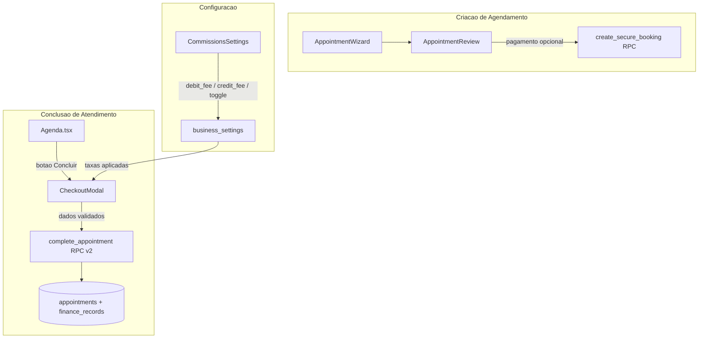

# Checkout de Comanda — Design

**Spec**: `.specs/features/checkout-comanda/spec.md`
**Status**: Draft

---

## Architecture Overview

O fluxo atual de conclusao de atendimento e direto: botao "Concluir" na Agenda chama `complete_appointment` RPC sem intermedios. O novo fluxo introduz um modal de checkout (`CheckoutModal`) que coleta dados de pagamento ANTES de chamar a RPC atualizada.

A separacao Debido/Credito substitui o "Cartao" unificado tanto na criacao (AppointmentReview) quanto no checkout (CheckoutModal). As taxas de maquininha sao configuradas pelo dono em Settings e aplicadas automaticamente no checkout quando a forma de pagamento e debito ou credito.



---

## Code Reuse Analysis

### Existing Components to Leverage

| Component | Location | How to Use |
|---|---|---|
| `Modal` | `components/Modal.tsx` | Base para CheckoutModal — usa `createPortal`, `FocusTrap`, tema dual |
| `ConfirmModal` | `components/Modal.tsx:225` | Reutilizar para dialogo de confirmacao (REQ-F2-06 padrao de confirm) |
| `BrutalButton` | `components/BrutalButton.tsx` | Botoes do modal — ja usado em toda a UI |
| `BrutalCard` | `components/BrutalCard.tsx` | Cards internos do modal |
| `useAuth` | `contexts/AuthContext.tsx` | `role`, `teamMemberId`, `region`, `userType` para logica condicional |
| `formatCurrency` | `utils/formatters.ts` | Formatacao de valores no checkout |
| `AppointmentReview` | `components/appointment/AppointmentReview.tsx` | Modificar para pagamento opcional + separar Debido/Credito |
| `CommissionsSettings` | `pages/settings/CommissionsSettings.tsx` | Estender com secao de taxa de maquininha |
| Padrao de payment options | `AppointmentReview.tsx:65-75` | Mesmo padrao de botoes de pagamento, agora com 4 opcoes |

### Integration Points

| System | Integration Method |
|---|---|
| `complete_appointment` RPC | Estender assinatura com novos params: `p_received_by`, `p_completed_by`, `p_machine_fee_percent`, `p_machine_fee_amount`, `p_payment_method` |
| `create_secure_booking` RPC | `p_payment_method` ja existe — apenas aceitar `NULL` como "definir depois" |
| `business_settings` | Novos campos: `machine_fee_enabled`, `debit_fee_percent`, `credit_fee_percent` |
| `appointments` | Novos campos: `received_by`, `machine_fee_percent`, `machine_fee_amount`, `completed_by`, `completed_at` |
| `finance_records` | Novos campos: `machine_fee_amount`, `commission_base` — populados pela RPC atualizada |
| `AlertsContext` / `SmartNotificationsBanner` | Ja existe no Dashboard — pode ser estendido para lembretes (F3) |

---

## Components

### CheckoutModal

- **Purpose**: Coletar dados de pagamento ao concluir um atendimento (substitui chamada direta a RPC)
- **Location**: `components/CheckoutModal.tsx`
- **Interfaces**:
  - `CheckoutModalProps { isOpen: boolean; onClose: () => void; appointment: Appointment; teamMembers: TeamMember[]; onConfirm: (checkoutData: CheckoutData) => void; }`
  - `CheckoutData { paymentMethod: string; receivedBy: string; machineFeePercent: number; machineFeeAmount: number; customPrice?: number; }`
- **Dependencies**: `useAuth` (region, role, teamMemberId), `business_settings` (taxas), `Modal` (base), `formatCurrency`
- **Reuses**: Padrao visual de `Modal.tsx`, botoes de pagamento de `AppointmentReview.tsx`

### AppointmentReview (MODIFICAR)

- **Purpose**: Tornar pagamento opcional na criacao + separar Debido/Credito
- **Location**: `components/appointment/AppointmentReview.tsx`
- **Changes**:
  - Adicionar opcao "Definir depois" como default no seletor de pagamento
  - Substituir "Cartao" por "Debito" + "Credito" (4 botoes BR, 4 botoes PT)
  - Props: `paymentMethod` pode ser `'' | 'Pix' | 'Dinheiro' | 'Debito' | 'Credito' | 'MBWay' | null`
- **Dependencies**: Nenhuma nova
- **Reuses**: Mesmo padrao existente

### CommissionsSettings (MODIFICAR)

- **Purpose**: Adicionar secao de configuracao de taxa de maquininha
- **Location**: `pages/settings/CommissionsSettings.tsx`
- **Changes**:
  - Novo card: toggle "Repassar taxa de maquininha ao colaborador?"
  - Campos: "Taxa debito (%)" e "Taxa credito (%)"
  - Persistir em `business_settings` via upsert existente
- **Dependencies**: Nenhuma nova
- **Reuses**: Mesmo padrao de upsert ja usado para `commission_settlement_day_of_month`

### Agenda.tsx (MODIFICAR)

- **Purpose**: Botao "Concluir" abre CheckoutModal em vez de chamar RPC direto
- **Location**: `pages/Agenda.tsx`
- **Changes**:
  - Estado novo: `checkoutAppointment: Appointment | null`
  - `handleCompleteAppointment` → abre modal em vez de chamar RPC
  - Novo handler `handleCheckoutConfirm(checkoutData)` → chama RPC atualizada
  - Badge "Pago via [metodo]" em agendamentos com status Completed
  - Botao "Concluir" desaparece quando status = Completed
- **Dependencies**: `CheckoutModal`
- **Reuses**: Mesma estrutura de modais existente

---

## Data Models

### CheckoutData (frontend)

```typescript
interface CheckoutData {
  paymentMethod: 'Pix' | 'Dinheiro' | 'Debito' | 'Credito' | 'MBWay';
  receivedBy: string;
  machineFeePercent: number;
  machineFeeAmount: number;
  customPrice?: number;
}
```

### Appointment (atualizado)

```typescript
interface Appointment {
  id: string;
  user_id: string;
  client_id: string;
  service: string;
  appointment_time: string;
  price: number;
  status: 'Pending' | 'Confirmed' | 'Completed' | 'Cancelled';
  professional_id: string | null;
  payment_method: string | null;
  received_by: string | null;
  machine_fee_percent: number;
  machine_fee_amount: number;
  completed_by: string | null;
  completed_at: string | null;
}
```

### BusinessSettings (campos novos)

```typescript
interface BusinessSettings {
  machine_fee_enabled: boolean;
  debit_fee_percent: number;
  credit_fee_percent: number;
}
```

### FinanceRecord (campos novos)

```typescript
interface FinanceRecord {
  machine_fee_amount: number;
  commission_base: number;
}
```

---

## RPC Changes: `complete_appointment` v2

**Assinatura atual:**
```sql
complete_appointment(p_appointment_id uuid) RETURNS void
```

**Nova assinatura:**
```sql
complete_appointment(
  p_appointment_id uuid,
  p_payment_method TEXT DEFAULT NULL,
  p_received_by UUID DEFAULT NULL,
  p_completed_by UUID DEFAULT NULL,
  p_machine_fee_percent DECIMAL(5,2) DEFAULT 0,
  p_machine_fee_amount DECIMAL(10,2) DEFAULT 0
) RETURNS void
```

**Logica adicional dentro da RPC:**
1. UPDATE `appointments` SET `payment_method`, `received_by`, `completed_by`, `completed_at = NOW()`, `machine_fee_percent`, `machine_fee_amount`
2. Calcular `commission_base = price - machine_fee_amount` (se `machine_fee_enabled` no business_settings)
3. Calcular `commission_value = commission_base * commission_rate / 100`
4. INSERT em `finance_records` com `machine_fee_amount` e `commission_base` populados

---

## Schema Changes (Migration)

```sql
-- appointments: novos campos
ALTER TABLE appointments ADD COLUMN IF NOT EXISTS received_by UUID REFERENCES team_members(id);
ALTER TABLE appointments ADD COLUMN IF NOT EXISTS machine_fee_percent DECIMAL(5,2) DEFAULT 0;
ALTER TABLE appointments ADD COLUMN IF NOT EXISTS machine_fee_amount DECIMAL(10,2) DEFAULT 0;
ALTER TABLE appointments ADD COLUMN IF NOT EXISTS completed_by UUID REFERENCES team_members(id);
ALTER TABLE appointments ADD COLUMN IF NOT EXISTS completed_at TIMESTAMP WITH TIME ZONE;

-- business_settings: taxa de maquininha
ALTER TABLE business_settings ADD COLUMN IF NOT EXISTS machine_fee_enabled BOOLEAN DEFAULT false;
ALTER TABLE business_settings ADD COLUMN IF NOT EXISTS debit_fee_percent DECIMAL(5,2) DEFAULT 0;
ALTER TABLE business_settings ADD COLUMN IF NOT EXISTS credit_fee_percent DECIMAL(5,2) DEFAULT 0;

-- finance_records: campos para comissao liquida
ALTER TABLE finance_records ADD COLUMN IF NOT EXISTS machine_fee_amount DECIMAL(10,2) DEFAULT 0;
ALTER TABLE finance_records ADD COLUMN IF NOT EXISTS commission_base DECIMAL(10,2);

-- payment_method: migrar 'Cartao' para 'Debito' (default)
UPDATE appointments SET payment_method = 'Debito' WHERE payment_method = 'Cartao';
UPDATE finance_records SET payment_method = 'Debito' WHERE payment_method = 'Cartao';

-- RLS: appointments UPDATE para campos novos (mesma politica existente)
-- Nenhuma mudanca necessaria — ja liberado para todos da mesma barbearia
```

---

## Error Handling Strategy

| Error Scenario | Handling | User Impact |
|---|---|---|
| Checkout sem forma de pagamento | Campo fica vermelho, mensagem "Selecione a forma de pagamento" | Bloqueia confirmacao |
| Checkout sem "Recebido por" | Campo fica vermelho, mensagem "Selecione quem recebeu" | Bloqueia confirmacao |
| Agendamento ja concluido (concorrencia) | RPC tem idempotency guard — retorna sem erro; UI verifica status antes de abrir modal | Botao "Concluir" desaparece |
| Taxa de maquininha > valor do servico | Validacao frontend bloqueia, mensagem "A taxa excede o valor do servico" | Bloqueia confirmacao |
| Valor zero (cortesia) | Permitir — comissao = 0, registra normalmente | Fluxo normal |
| Cancelar agendamento ja pago (Completed) | Bloquear cancelamento com toast | "Este agendamento ja foi finalizado" |
| RPC fallback (updated_at nao existe) | Manter fallback existente em Agenda.tsx:743-832 | Funciona parcialmente |

---

## Tech Decisions

| Decision | Choice | Rationale |
|---|---|---|
| Modal base | Usar `Modal` do `components/Modal.tsx` | Padrao consistente do projeto. `CommissionsManagement` usa overlay custom — nao seguir esse anti-padrao |
| Pagamento opcional na criacao | Default = NULL, label "Definir depois" | Nao quebra fluxo existente. `create_secure_booking` ja aceita `p_payment_method` |
| Taxa de maquininha no checkout | Ler de `business_settings` ao abrir modal, preencher automaticamente | Evita roundtrip extra. Taxa e fixa por tipo de cartao, nao muda por atendimento |
| Debido/Credito migration | `Cartao` → `Debito` como default | Maioria dos casos no passado era debito. Dono pode corrigir manualmente se necessario |
| `completed_by` vs `received_by` | Ambos no schema, `received_by` obrigatorio na UI, `completed_by` = `teamMemberId` automatico | `completed_by` preenchido automaticamente pelo frontend, `received_by` exige selecao |
| `commission_base` calculado na RPC | Sim — `price - machine_fee_amount` se `machine_fee_enabled` | Fonte de verdade no banco. Evita divergencia entre frontend e finance_records |
| Orphan column `commission_settlement_day_of_month` | Criar migration formal para ela | Coluna existe mas nao tem migration. Aproveitar a migration desta feature |

---

## CheckoutModal — Wireframe (texto)

```
+-----------------------------------------------+
| [X]  Concluir Atendimento                      |
+-----------------------------------------------+
|                                                |
|  Cliente: Joao Silva                           |
|  Servico: Corte + Barba                        |
|  Profissional: Carlos                          |
|                                                |
|  Preco Final (*)      [  R$ 45,00  ]           |
|                                                |
|  Forma de Pagamento                            |
|  [Pix] [Dinheiro] [Debito] [Credito]          |
|                                                |
|  --- se Debito/Credito ---                     |
|  Taxa da Maquininha (%)  [ 2,50 ]              |
|  Valor Liquido: R$ 43,88                       |
|  --- fim ---                                   |
|                                                |
|  Recebido por (*)    [Selecione ▼]             |
|  (dropdown: todos colaboradores ativos + dono) |
|                                                |
|  [Cancelar]              [Confirmar Pagamento] |
+-----------------------------------------------+
```
