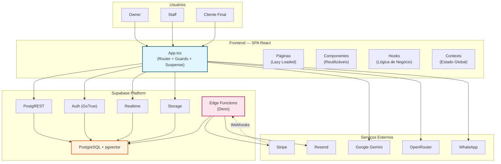

# Visão Geral Arquitetural — agendix

> Gerado pelo Architect em 2026-05-06
> Nível de documentação: **Detalhado**
> Nível de confiança: 🟢 Confirmado | 🟡 Inferido | 🔴 Lacuna

---

## Resumo Executivo

**agendix** (também conhecido como *Beauty OS* / *AgenX*) é um SaaS multi-tenant para gestão de barbearias e salões de beleza. A arquitetura segue um padrão **SPA + BaaS** (Backend-as-a-Service), onde o frontend React consome serviços do Supabase (PostgreSQL, Auth, Storage, Realtime) e integra-se com Stripe (pagamentos), Google Gemini (IA/embeddings), OpenRouter (LLM proxy) e WhatsApp (comunicação).

A aplicação é **mobile-first**, projetada para uso primário em celulares por barbeiros e profissionais de beleza. Utiliza **HashRouter** para compatibilidade com hospedagem estática e **PWA** para experiência de app nativo.

---

## Princípios Arquiteturais

1. **Multi-tenancy por RLS**: Isolamento de dados por `company_id` via Row Level Security do PostgreSQL. Nenhum dado cruza tenants.
2. **Server-side logic em RPCs**: Lógica crítica (checkout, comissões, auditoria) implementada em funções PostgreSQL `SECURITY DEFINER` para bypass seguro de RLS.
3. **Real-time por default**: Agenda, fila digital e bookings públicos usam Supabase Realtime para sincronização instantânea entre dispositivos.
4. **Mobile-first**: Design responsivo otimizado para telas pequenas; PWA permite instalação.
5. **Herança owner→staff**: Staff herda configurações, assinatura e tema do owner, simplificando gestão de múltiplos profissionais.

---

## Visão Geral da Arquitetura

---

## Componentes Arquiteturais

### 1. Frontend (SPA React)
- **Framework**: React 19 + TypeScript 5.8 + Vite 6.2
- **Estilização**: Tailwind CSS + shadcn/ui + design system interno
- **Roteamento**: react-router-dom (HashRouter)
- **State**: React Context (Auth, UI, PublicClient, Wizard, GuidedMode)
- **PWA**: vite-plugin-pwa com auto-update
- **Lazy Loading**: Todas as páginas carregadas via `React.lazy()` dentro de `<Suspense>`

### 2. Backend (Supabase)
- **Banco**: PostgreSQL 15+ com extensão pgvector (embeddings 768d)
- **Auth**: Supabase Auth com MFA TOTP, JWT sessions
- **API**: PostgREST expondo tabelas e 50+ RPCs
- **Realtime**: Subscriptions WebSocket para postgres_changes
- **Storage**: 5 buckets S3-compatible para imagens
- **Edge Functions**: 2 funções Deno (Stripe checkout, email reminders)

### 3. Integrações Externas
- **Stripe**: Checkout de assinaturas (planos Solo/Equipe) com preços por região
- **Google Gemini**: Embeddings para RAG, análise de imagens
- **OpenRouter**: Chat completions para AI Assistant
- **WhatsApp**: Deep links para confirmações e campanhas
- **Resend**: Emails transacionais via Edge Function

---

## Estrutura de Dados

O modelo de dados é **relacional com extensões vetoriais** e consiste em 20+ tabelas organizadas em domínios:

| Domínio | Tabelas Principais |
|---------|-------------------|
| **Autenticação** | auth.users (GoTrue), profiles |
| **Equipe** | team_members |
| **Clientes** | clients, public_clients, client_semantic_memory |
| **Agendamentos** | appointments, public_bookings |
| **Fila** | queue_entries |
| **Serviços** | services, service_categories |
| **Financeiro** | finance_records, commission_payments |
| **Configurações** | business_settings, goal_settings, onboarding_progress |
| **Segurança** | audit_logs, system_errors |
| **IA** | ai_knowledge_base, aios_logs, rag_context_* |

> Ver `erd-complete.md` para diagrama detalhado com cardinalidades.

---

## Decisões Arquiteturais (ADRs)

| # | Decisão | Contexto | Trade-off |
|---|---------|----------|-----------|
| ADR-A1 | **SPA + BaaS** ao invés de full-stack framework | Reduz infraestrutura própria; equipe pequena. | Menor controle sobre backend; vendor lock-in no Supabase. |
| ADR-A2 | **HashRouter** em vez de BrowserRouter | Hospedagem estática (Vercel); evita configuração de rewrite. | URLs menos "limpas"; não amigáveis para SEO. |
| ADR-A3 | **RLS como mecanismo de multi-tenancy** | Isolamento nativo no banco; sem middleware customizado. | Complexidade em evolução (96 migrations de RLS); debugging difícil. |
| ADR-A4 | **RPCs SECURITY DEFINER** para lógica crítica | Bypass seguro de RLS para operações complexas. | Lógica de negócio dividida entre frontend e banco; testabilidade reduzida. |
| ADR-A5 | **PWA em vez de app nativo** | Público-alvo mobile; custo de desenvolvimento menor. | Capacidades nativas limitadas; depende de browser. |
| ADR-A6 | **pgvector para RAG semântico** | Busca por similaridade nativa no PostgreSQL. | Escalabilidade limitada para milhões de vetores (ivfflat). |
| ADR-A7 | **Dual booking system** (public_bookings → appointments) | Booking público requer aprovação do owner. | Complexidade de sincronização; duplicação conceitual. |

---

## Dívidas Técnicas Arquiteturais

| # | Dívida | Severidade | Descrição |
|---|--------|------------|-----------|
| DT-A1 | `isDev` hardcoded | 🟡 Baixa | Email de dev hardcoded não escalável. |
| DT-A2 | Dual onboarding system | 🟡 Média | Wizard novo e legado coexistem; aumenta complexidade. |
| DT-A3 | Staff RPC permissions | 🟡 Média | Possível lacuna em validação de permissões em RPCs. |
| DT-A4 | Sem testes E2E no CI | 🟢 Baixa | Playwright configurado mas não rodando no pipeline. |
| DT-A5 | 96 migrations | 🟡 Média | Histórico extenso dificulta compreensão do schema atual. |
| DT-A6 | Frontend state em múltiplos contexts | 🟢 Baixa | Auth, UI, PublicClient, Wizard, GuidedMode — sem state manager unificado. |

---

## Segurança

- **Autenticação**: Supabase Auth (email/senha) + MFA TOTP
- **Autorização**: RLS policies por `company_id` via `get_auth_company_id()`
- **Rate Limiting**: Token bucket no login (`check_login_rate_limit`)
- **Audit**: Trigger automático em 6 tabelas → `audit_logs`
- **Soft Delete**: Lixeira com 30 dias + restore via RPC dinâmica
- **Dev Guard**: `DevRouteGuard` protege rotas de auditoria/erros

---

## Escalabilidade e Performance

- **Banco**: Supabase managed PostgreSQL; pgvector com índice ivfflat
- **Cache**: Sem cache explícito de API; semantic cache com threshold 0.92
- **Assets**: Vite com hash em produção; CDN via Vercel
- **Realtime**: Subscriptions filtradas por `company_id` para limitar payload
- **Imagens**: Upload otimizado para Storage; sem transformação de imagem mencionada

---

## Documentação Relacionada

- `c4-context.md` — Diagrama C4 Nível 1 (Contexto)
- `c4-containers.md` — Diagrama C4 Nível 2 (Containers)
- `c4-components.md` — Diagrama C4 Nível 3 (Componentes)
- `erd-complete.md` — Diagrama ER completo
- `traceability/spec-impact-matrix.md` — Matriz de impacto entre componentes
- `deployment.md` — Infraestrutura e deployment

---

*Fim da visão geral arquitetural.*
