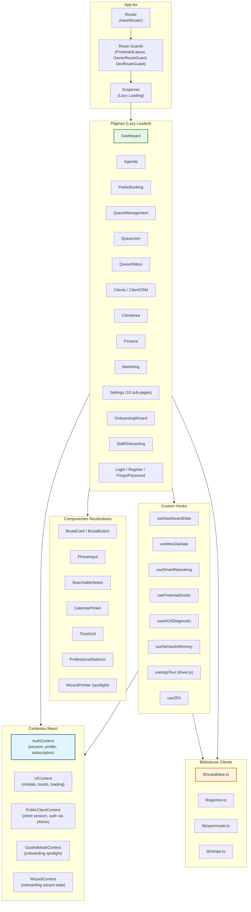
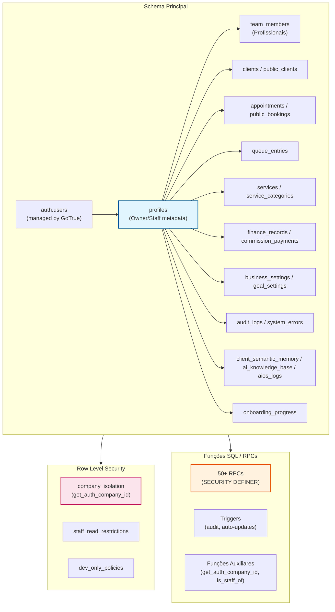

# Diagrama C4 — Componentes (Nível 3)

> agendix (Beauty OS / AgendiX)
> Gerado pelo Architect em 2026-05-06
> Nível de confiança: 🟢 Confirmado | 🟡 Inferido | 🔴 Lacuna

---

## Container: SPA React (Frontend)

---

### Componentes do Frontend

| Componente | Tecnologia | Responsabilidade |
|------------|------------|------------------|
| **Router** | react-router-dom (HashRouter) | Roteamento client-side, lazy loading de páginas |
| **ProtectedLayout** | React component | Verifica autenticação e redireciona para login/onboarding |
| **OwnerRouteGuard** | React component | Bloqueia rotas restritas a staff; redireciona para dashboard |
| **DevRouteGuard** | React component | Bloqueia rotas de auditoria/erros/lixeira para não-devs |
| **AuthContext** | React Context | Estado global de autenticação: sessão, perfil, assinatura, trial, role |
| **UIContext** | React Context | Estado global de UI: modais, toasts, loading states |
| **PublicClientContext** | React Context | Sessão do cliente público: login via telefone, registro, espelhamento CRM |
| **WizardContext** | React Context | Estado do onboarding wizard (novo): step atual, dados por step |
| **GuidedModeContext** | React Context | Gerenciamento do modo guiado pós-wizard: spotlight, progresso |
| **Dashboard** | React page (lazy) | Visão dual owner/staff: métricas, ações, setup copilot, AIOS |
| **Agenda** | React page (lazy) | CRUD de agendamentos, aceite de bookings, checkout, calendário |
| **PublicBooking** | React page (lazy) | Fluxo conversacional de reserva pública: serviços, data, profissional |
| **QueueManagement** | React page (lazy) | Gestão da fila digital pelo owner: chamar, atender, finalizar |
| **Finance** | React page (lazy) | Controle financeiro, comissões, relatórios, assinaturas |
| **Settings** | React page (lazy) | Hub de configurações com 10 sub-páginas e RBAC |
| **useDashboardData** | Custom Hook | Fetch consolidado de estatísticas, metas, ações, maturidade de dados |
| **useSmartRebooking** | Custom Hook | Cálculo de cadência preditiva para sugerir reagendamentos |
| **useFinancialDoctor** | Custom Hook | Cálculo de health score e geração de insights contextuais |
| **useAIOSDiagnostic** | Custom Hook | Diagnóstico de churn: clientes em risco, receita recuperável |
| **useSemanticMemory** | Custom Hook | Geração de embeddings e busca por similaridade (RAG) |
| **lib/supabase.ts** | Cliente TS | Singleton do cliente Supabase com interceptors e configuração de auth |
| **lib/gemini.ts** | Cliente TS | Wrapper para Google Generative AI (embeddings e text generation) |
| **lib/openrouter.ts** | Cliente TS | Wrapper para OpenRouter API (chat completions) |

---

## Container: Supabase PostgreSQL (Backend)

---

### Componentes do Backend

| Componente | Tecnologia | Responsabilidade |
|------------|------------|------------------|
| **auth.users** | Supabase GoTrue | Tabela gerenciada: identidades, senhas, MFA factors |
| **profiles** | PostgreSQL | Metadados de usuários: role, company_id, subscription, trial, configurações |
| **team_members** | PostgreSQL | Cadastro de profissionais, comissões, slugs para portfolio público |
| **appointments** | PostgreSQL | Agendamentos confirmados/completados/cancelados |
| **public_bookings** | PostgreSQL | Reservas públicas pendentes (dual booking system) |
| **queue_entries** | PostgreSQL | Fila digital: entradas com status e timestamps |
| **clients** | PostgreSQL | Clientes do CRM com soft delete, tier de fidelidade |
| **public_clients** | PostgreSQL | Clientes que reservaram via link público |
| **finance_records** | PostgreSQL | Registro financeiro: receitas e despesas com comissões |
| **business_settings** | PostgreSQL | Configurações centralizadas do negócio (JSONB + colunas) |
| **audit_logs** | PostgreSQL | Logs de auditoria com diff campo-a-campo |
| **client_semantic_memory** | PostgreSQL (pgvector) | Memórias semânticas com embeddings 768d |
| **ai_knowledge_base** | PostgreSQL (pgvector) | Cache semântico de respostas da IA |
| **onboarding_progress** | PostgreSQL | Wizard novo: steps, dados, progresso (JSONB) |
| **RLS Policies** | PostgreSQL | 100+ policies em evolução; isolamento por company_id via `get_auth_company_id()` |
| **RPCs** | PostgreSQL (plpgsql) | 50+ funções SECURITY DEFINER para lógica crítica |
| **Triggers** | PostgreSQL | Auditoria automática em 6 tabelas; auto-updates de timestamps |
| **Edge Functions** | Deno | Stripe checkout, envio de email |

---

## Container: Supabase Storage

| Bucket | Conteúdo | Acesso |
|--------|----------|--------|
| **logos** | Logos dos estabelecimentos | Público (read), Owner (write) |
| **covers** | Fotos de capa | Público (read), Owner (write) |
| **service_images** | Imagens dos serviços | Público (read), Owner (write) |
| **team_photos** | Fotos dos profissionais | Público (read), Owner (write) |
| **client_photos** | Fotos dos clientes | Owner/Staff (read/write) |

---

*Fim do diagrama C4 Componentes.*
