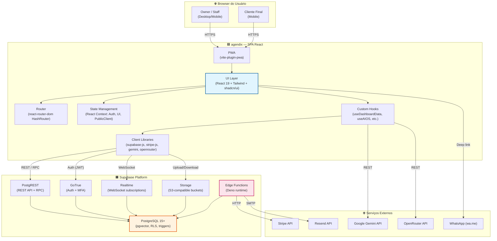

# Diagrama C4 — Containers (Nível 2)

> agendix (Beauty OS / AgenX)
> Gerado pelo Architect em 2026-05-06
> Nível de confiança: 🟢 Confirmado | 🟡 Inferido | 🔴 Lacuna

---

---

## Containers Identificados

### 1. SPA React (Frontend)
- **Tecnologia**: React 19, TypeScript 5.8, Vite 6.2, Tailwind CSS, shadcn/ui
- **Responsabilidade**: Interface completa, roteamento (HashRouter), gerenciamento de estado, comunicação com backend, integrações com APIs externas.
- **Formato**: Single Page Application, empacotada como PWA.
- **Porta**: 3000 (dev), servida via Vercel/CDN em produção.

### 2. Supabase Platform (Backend-as-a-Service)
- **Tecnologia**: PostgreSQL 15+, GoTrue, PostgREST, Realtime, Storage, Edge Functions (Deno)
- **Responsabilidade**: Persistência, autenticação, autorização (RLS), lógica de negócio via RPCs, realtime, storage de arquivos, execução de funções serverless.

#### Sub-containers:
| Sub-container | Tecnologia | Responsabilidade |
|---------------|------------|------------------|
| **PostgreSQL** | PostgreSQL 15+ com pgvector | Banco relacional, RLS policies, triggers de auditoria, extensão pgvector para embeddings |
| **PostgREST** | PostgREST | Expõe tabelas e RPCs como API REST |
| **GoTrue** | GoTrue (Supabase Auth) | Autenticação JWT, MFA TOTP, gestão de sessões |
| **Realtime** | Elixir/Phoenix | Subscriptions WebSocket para mudanças em tabelas |
| **Storage** | S3-compatible | Buckets: logos, covers, service_images, team_photos, client_photos |
| **Edge Functions** | Deno | `create-checkout-session` (Stripe), `send-appointment-reminder` (Resend) |

### 3. Stripe (Pagamentos)
- **Tecnologia**: API REST, Webhooks
- **Responsabilidade**: Processamento de checkout para planos Solo/Equipe, gestão de assinaturas, webhooks para atualização de status.

### 4. Google Gemini API (IA / Embeddings)
- **Tecnologia**: REST API (`@google/generative-ai`)
- **Responsabilidade**: Geração de embeddings 768d para memória semântica (RAG), análise de imagens, geração de conteúdo.

### 5. OpenRouter (LLM Proxy)
- **Tecnologia**: REST API
- **Responsabilidade**: Chat completions para AI Assistant, calendário de conteúdo de marketing, acesso a múltiplos modelos.

### 6. WhatsApp (Comunicação)
- **Tecnologia**: Deep links (`https://wa.me/{phone}?text={message}`)
- **Responsabilidade**: Envio de mensagens de confirmação e campanhas de reativação.

### 7. Resend (Email)
- **Tecnologia**: REST API
- **Responsabilidade**: Envio de emails transacionais (lembretes de agendamento).

---

## Comunicação entre Containers

| Origem | Destino | Protocolo | Dados |
|--------|---------|-----------|-------|
| Browser | SPA React | HTTPS | HTML/JS/CSS (static), API calls |
| SPA React | Supabase PostgREST | HTTPS (REST) | JSON — queries, mutations, RPCs |
| SPA React | Supabase Auth | HTTPS (REST) | JSON — login, logout, MFA |
| SPA React | Supabase Realtime | WSS (WebSocket) | JSON — postgres_changes subscriptions |
| SPA React | Supabase Storage | HTTPS (REST) | multipart — upload/download de imagens |
| SPA React | Stripe.js | HTTPS (REST) | JSON — checkout session creation |
| SPA React | Gemini API | HTTPS (REST) | JSON — embeddings, text generation |
| SPA React | OpenRouter | HTTPS (REST) | JSON — chat completions |
| SPA React | WhatsApp | HTTPS (redirect) | URL params — phone, message |
| Supabase Edge Function | Stripe API | HTTPS (REST) | JSON — create checkout session |
| Supabase Edge Function | Resend API | HTTPS (REST) | JSON — send email |
| Stripe | Supabase Edge Function | HTTPS (Webhook) | JSON — payment status updates |

---

## Decisiones Arquiteturais

| # | Decisão | Contexto | Alternativa Descartada |
|---|---------|----------|------------------------|
| ADR-C1 | **HashRouter** ao invés de BrowserRouter | SPA servida como static site; evita configuração de rewrite rules no servidor. | BrowserRouter (requer SSR ou rewrite rules) |
| ADR-C2 | **Supabase como BaaS completo** | Reduz infraestrutura própria; RLS nativo; realtime built-in. | Firebase, AWS Amplify, backend Node.js próprio |
| ADR-C3 | **RPCs SECURITY DEFINER** no PostgreSQL | Lógica crítica server-side com bypass de RLS para operações complexas. | Edge Functions para toda lógica de negócio |
| ADR-C4 | **PWA com vite-plugin-pwa** | Público-alvo usa celular; permite instalação e offline básico. | React Native, app nativo |
| ADR-C5 | **Stripe Checkout Session** | Fluxo de pagamento seguro, redirecionamento para Stripe. | Stripe Elements (embedded) |

---

*Fim do diagrama C4 Containers.*
