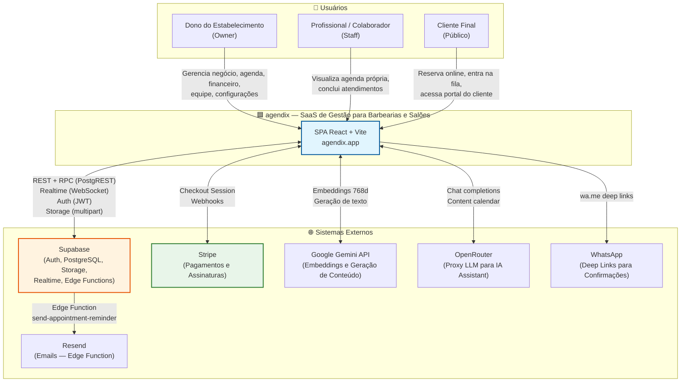

# Diagrama C4 — Contexto (Nível 1)

> agendix (Beauty OS / AgendiX)
> Gerado pelo Architect em 2026-05-06
> Nível de confiança: 🟢 Confirmado | 🟡 Inferido | 🔴 Lacuna

---

---

## Atores e Sistemas Externos

| Entidade | Tipo | Descrição | Protocolo |
|----------|------|-----------|-----------|
| **Owner** | Pessoa | Dono do estabelecimento. Acesso total ao sistema. | HTTPS / Browser |
| **Staff** | Pessoa | Profissional vinculado a um owner. Visão restrita. | HTTPS / Browser |
| **Cliente** | Pessoa | Cliente final que reserva online ou usa a fila digital. | HTTPS / Browser |
| **Supabase** | Sistema externo | Backend-as-a-Service: PostgreSQL, Auth, Storage, Realtime, Edge Functions (Deno). | HTTPS (REST/WS) |
| **Stripe** | Sistema externo | Processamento de pagamentos e assinaturas recorrentes. | HTTPS (REST + Webhooks) |
| **Google Gemini** | Sistema externo | Geração de embeddings (768d) e conteúdo para IA Assistant. | HTTPS (REST) |
| **OpenRouter** | Sistema externo | Proxy para múltiplos modelos LLM (chat completions). | HTTPS (REST) |
| **WhatsApp** | Sistema externo | Envio de mensagens de confirmação e reativação via deep links. | HTTPS (wa.me) |
| **Resend** | Sistema externo | Envio de emails transacionais (lembretes de agendamento). | HTTPS (REST) |

---

## Relacionamentos Principais

1. **Owner/Staff → agendix**: Interagem com a SPA React via navegador. Autenticação via Supabase Auth (email/senha + 2FA TOTP).
2. **Cliente → agendix**: Interage com páginas públicas (`/book/:slug`, `/queue/:slug`, `/minha-area/:slug`) sem autenticação ou via telefone.
3. **agendix ↔ Supabase**: Comunicação principal. Queries SQL via PostgREST, chamadas RPC (SECURITY DEFINER), subscriptions realtime para agenda/fila/bookings, upload/download de arquivos (Storage).
4. **agendix ↔ Stripe**: Criação de checkout sessions para planos Solo/Equipe. Webhooks (processados via Edge Function) atualizam status de assinatura.
5. **agendix ↔ Gemini**: Geração de embeddings para memória semântica (RAG) e análise de imagens.
6. **agendix ↔ OpenRouter**: Chat do AI Assistant e geração de calendário de conteúdo de marketing.
7. **agendix → WhatsApp**: Geração de links `wa.me` com mensagens pré-formatadas para confirmações e campanhas de reativação.
8. **Supabase → Resend**: Edge Function `send-appointment-reminder` dispara emails de lembrete 24h antes.

---

## Dívidas Técnicas Identificadas no Contexto

| # | Dívida | Impacto |
|---|--------|---------|
| DT1 | `isDev` hardcoded por email (`rleporesilva@gmail.com`) — não escalável para múltiplos devs. | Baixo |
| DT2 | Staff pode teoricamente chamar RPCs sem filtro adequado no backend (presume-se filtro no frontend). | Médio |
| DT3 | Dual onboarding system (wizard novo em `onboarding_progress` + wizard legado em `business_settings`) aumenta complexidade cognitiva. | Médio |

---

*Fim do diagrama C4 Contexto.*
