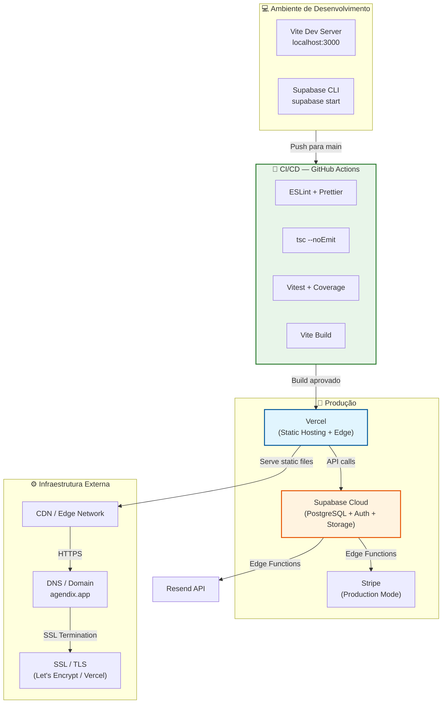

# Deployment — agendix

> Gerado pelo Architect em 2026-05-06
> Nível de confiança: 🟢 Confirmado | 🟡 Inferido | 🔴 Lacuna
> Disponível apenas em modo **detalhado**.

---



---

## Ambiente de Desenvolvimento

| Componente | Tecnologia | Configuração |
|------------|------------|--------------|
| **Dev Server** | Vite 6.2 | Porta 3000, `--host` para acesso local em rede |
| **Backend Local** | Supabase CLI 2.72.0 | `supabase start` — Docker Compose com PostgreSQL, GoTrue, PostgREST, Storage, Realtime |
| **Banco Local** | PostgreSQL 15+ | Migrations aplicadas via `supabase db reset` |
| **Edge Functions Local** | Deno | `supabase functions serve` para teste local |
| **Testes** | Vitest 2.1.8 | Ambiente happy-dom/jsdom, coverage v8 |
| **E2E** | Playwright 1.58.2 | Testes de ponta a ponta |

---

## Pipeline CI/CD

Arquivo: `.github/workflows/ci.yml`

```yaml
# Pipeline simplificada (inferida do inventário)
on:
  push:
    branches: [main]
  pull_request:
    branches: [main]

jobs:
  quality:
    runs-on: ubuntu-latest
    steps:
      - uses: actions/checkout@v4
      - uses: actions/setup-node@v4
        with:
          node-version: '20'
      - run: npm ci
      - run: npm run lint        # ESLint zero warnings
      - run: npm run typecheck   # tsc --noEmit
      - run: npm test            # Vitest
      - run: npm run build       # Vite build production
```

| Gate | Comando | Critério de Aprovação |
|------|---------|----------------------|
| **Lint** | `npm run lint` | Zero erros e zero warnings |
| **TypeCheck** | `npm run typecheck` | Sem erros de TypeScript (strict mode) |
| **Testes** | `npm test` | Todos os testes passam |
| **Build** | `npm run build` | Build de produção completa sem erros |

---

## Ambiente de Produção

### Frontend

| Aspecto | Configuração |
|---------|--------------|
| **Plataforma** | Vercel |
| **Tipo** | Static Site (SPA) |
| **Framework** | React 19 + Vite 6 |
| **PWA** | vite-plugin-pwa (auto-update, manifest BeautyOS) |
| **Routing** | HashRouter (`/#/rota`) |
| **SSL** | Automático (Let's Encrypt via Vercel) |
| **Cache** | Static assets com hash (Vite default) |

### Backend

| Aspecto | Configuração |
|---------|--------------|
| **Plataforma** | Supabase Cloud |
| **Banco** | PostgreSQL 15+ com pgvector |
| **Auth** | Supabase Auth (GoTrue) com MFA TOTP |
| **Storage** | S3-compatible (5 buckets) |
| **Realtime** | WebSocket subscriptions |
| **Edge Functions** | Deno runtime (2 funções) |
| **RLS** | 100+ policies em evolução |

### Edge Functions

| Função | Runtime | Gatilho | Responsabilidade |
|--------|---------|---------|------------------|
| **create-checkout-session** | Deno | HTTP (POST) | Cria sessão Stripe com preços por região (BRL/EUR) |
| **send-appointment-reminder** | Deno | HTTP (POST) / Cron | Envia email de lembrete 24h antes do agendamento |

---

## Variáveis de Ambiente

Arquivo: `.env.example`

| Variável | Origem | Uso |
|----------|--------|-----|
| `VITE_SUPABASE_URL` | Supabase Project Settings | URL do projeto Supabase |
| `VITE_SUPABASE_ANON_KEY` | Supabase Project Settings | Chave anônima para cliente |
| `VITE_STRIPE_PUBLIC_KEY` | Stripe Dashboard | Chave pública Stripe.js |
| `VITE_GEMINI_API_KEY` | Google AI Studio | Chave Gemini para embeddings |
| `VITE_OPENROUTER_API_KEY` | OpenRouter Dashboard | Chave para chat completions |

> 🔴 **Lacuna**: Não foi possível verificar se existem variáveis server-side (usadas pelas Edge Functions) documentadas em `.env.example`.

---

## Considerações de Escalabilidade

| Aspecto | Estado Atual | Recomendação |
|---------|-------------|--------------|
| **Banco de Dados** | Supabase managed PostgreSQL | Monitorar uso de conexões; considerar read replicas se > 1000 usuários ativos simultâneos |
| **Storage** | Supabase Storage (S3) | Buckets públicos com RLS; considerar CDN externo para imagens se alto tráfego |
| **Edge Functions** | 2 funções Deno | Stripe checkout pode exigir timeout ajustado; monitorar cold starts |
| **PWA** | Service worker básico | Implementar cache estratégico para assets críticos; considerar background sync para fila offline |
| **Realtime** | WebSocket subscriptions | Limitar número de subscriptions simultâneas por cliente; usar filtros específicos |

---

## Dívidas Técnicas de Infraestrutura

| # | Dívida | Impacto |
|---|--------|---------|
| DT-INF-1 | Sem Docker/Docker Compose no projeto — desenvolvimento depende de Supabase CLI local. | Baixo |
| DT-INF-2 | Sem ambiente de staging explícito mencionado. | Médio |
| DT-INF-3 | Edge Functions não têm testes automatizados mencionados. | Médio |
| DT-INF-4 | CI não inclui testes E2E (Playwright) no pipeline. | Baixo |

---

*Fim do documento de Deployment.*
