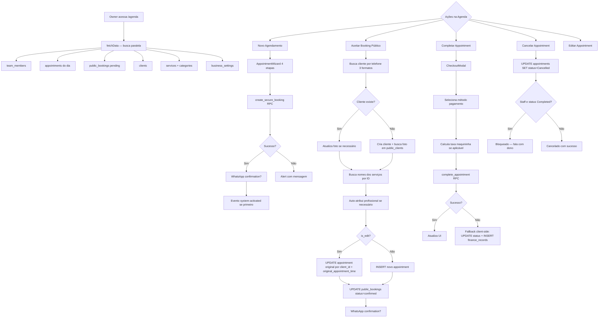
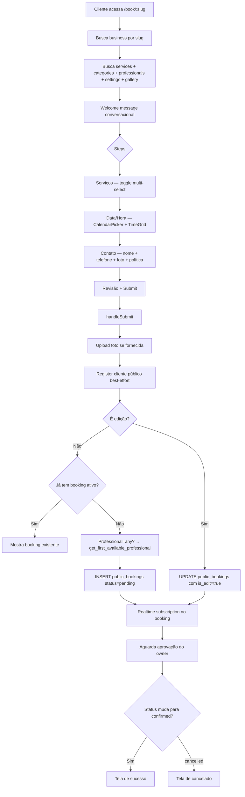
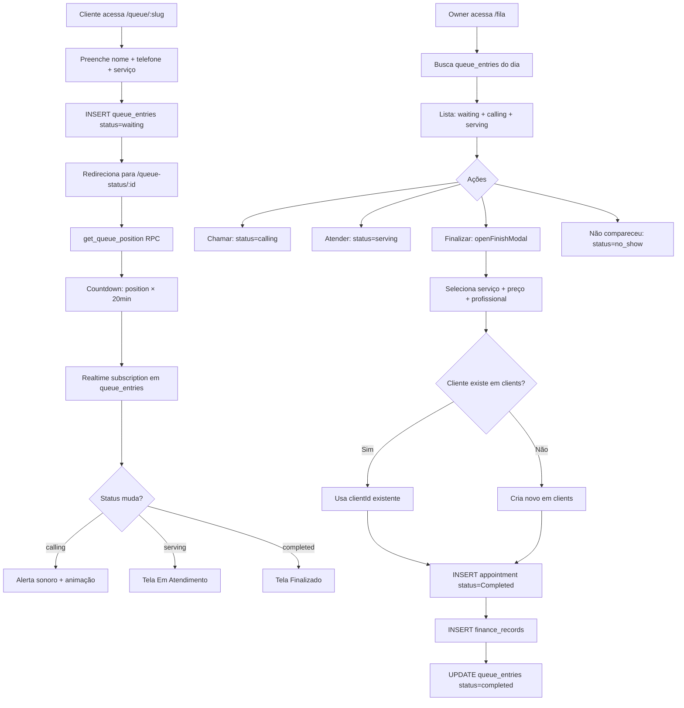
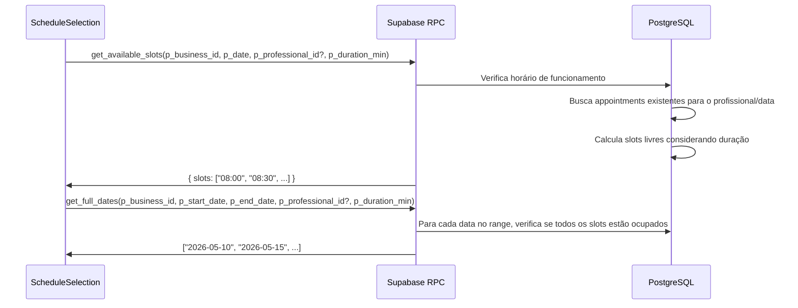
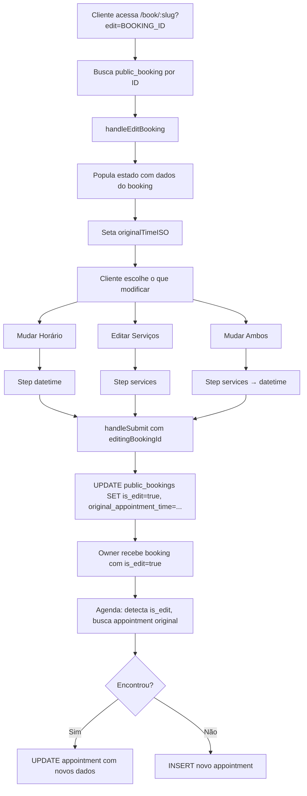

# Flowchart — Módulo: agenda

## 1. Fluxo Principal — Agenda Interna

## 2. Fluxo — Booking Público

## 3. Fluxo — Fila Digital

## 4. Fluxo — Disponibilidade de Horários (RPC)

## 5. Fluxo — Edição de Booking pelo Cliente

