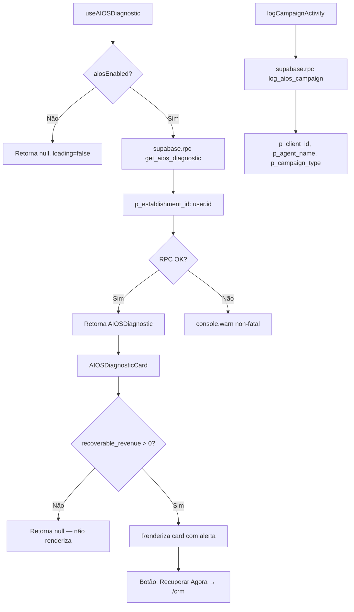
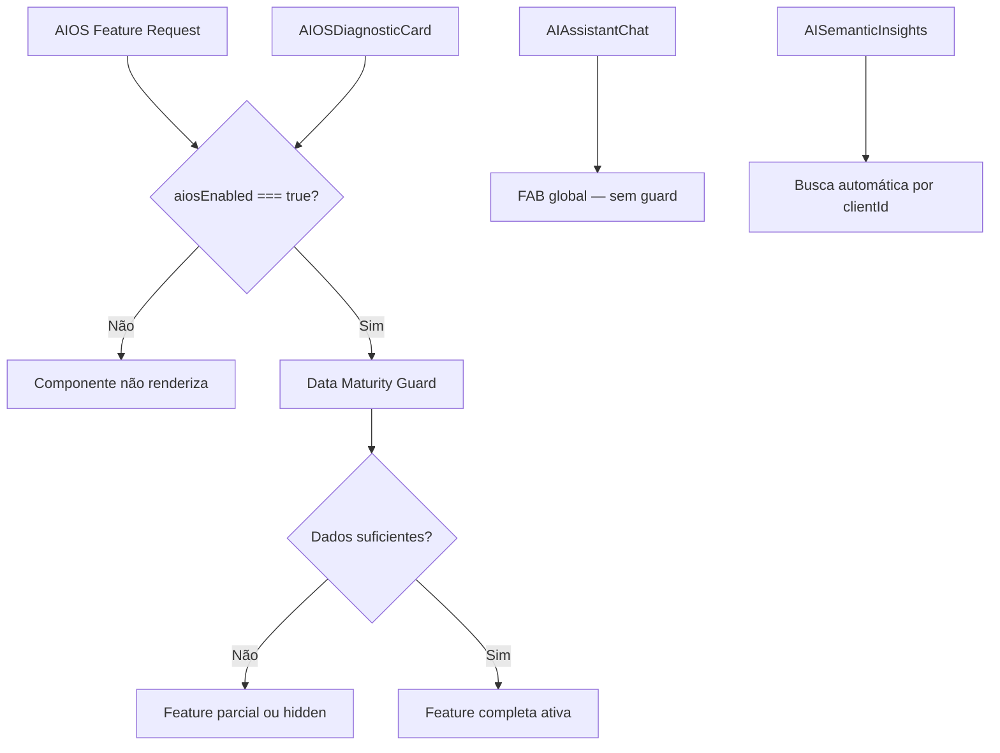

# Flowchart — ai-assistant

> Gerado pelo Archaeologist em 2026-05-04
> Nível: Detalhado

---

## 1. AI Chat — useAIAssistant

```mermaid
flowchart TD
    A[Usuário digita mensagem] --> B[sendMessage userMessage]
    B --> C[buildContext]
    C --> D[Coleta dados do negócio]
    D --> D1[businessName, userType, region — AuthContext]
    D --> D2[currentMonthRevenue, profitMetrics — DashboardData]
    D --> D3[appointments, diagnostic — hooks]
    D --> D4[avgTicket, topService — FinancialDoctor]
    D4 --> E[buildSystemPrompt ctx]
    E --> F[Monta mensagens: system + últimos 6 msgs + user msg]
    F --> G[fetch OpenRouter API]
    G --> H[POST /chat/completions]
    H --> I[model: gemini-2.0-flash-lite-001]
    I --> J[max_tokens: 300, temperature: 0.7]
    J --> K{Response OK?}
    K -->|Sim| L[Extrai data.choices[0].message.content]
    K -->|Não| M[logger.error + mensagem fallback]
    L --> N[Adiciona assistantMsg ao state]
```

## 2. AIOS Diagnostic



## 3. Semantic Memory (RAG)

```mermaid
flowchart TD
    subgraph Save Memory
        A1[saveMemory clientId, observation, contextType] --> B1[generateEmbedding observation]
        B1 --> C1[Gemini text-embedding-004 → 768 dims]
        C1 --> D1[INSERT INTO client_semantic_memory]
        D1 --> E1[client_id, observation, embedding, context_type]
    end

    subgraph Search Memories
        A2[searchMemories clientId, query, limit, threshold] --> B2[generateEmbedding query]
        B2 --> C2[SUPABASE RPC match_client_memories]
        C2 --> D2[p_client_id, query_embedding, match_threshold, match_count]
        D2 --> E2[Retorna SemanticMemory[] com similarity]
    end

    subgraph Semantic Cache
        A3[getSemanticCache query, threshold=0.92] --> B3[generateEmbedding query]
        B3 --> C3[SUPABASE RPC match_kb_content]
        C3 --> D3{Similarity > 0.92?}
        D3 -->|Sim| E3[Retorna resposta cacheada]
        D3 -->|Não| F3[Chama API Gemini]
        F3 --> G3[Salva em ai_knowledge_base via saveSemanticCache]
    end
```

## 4. Content Calendar Generation

```mermaid
flowchart TD
    A[useContentCalendar.generatePosts year, month] --> B[getDaysInMonth + getHolidaysForMonth]
    B --> C[Monta prompt com feriados BR]
    C --> D[fetch OpenRouter API]
    D --> E[model: gemini-2.0-flash-lite-001]
    E --> F[response_format: json_object]
    F --> G[Parse JSON → CalendarPost[]]
    G --> H[Mapeia gradients cíclicos e feriados]
    H --> I[Retorna posts para UI]
```

## 5. Gemini Direct Services

```mermaid
flowchart TD
    subgraph Embeddings
        A1[generateEmbedding text] --> B1[Gemini text-embedding-004]
        B1 --> C1[Retorna number[] 768 dims]
    end

    subgraph Photo Analysis
        A2[analyzePhoto imageBase64] --> B2[Gemini gemini-1.5-flash]
        B2 --> C2[GeminiPhotoAnalysis]
    end

    subgraph Social Content
        A3[generateSocialContent] --> B3[Cache check: getSemanticCache]
        B3 -->|Hit| C3[Retorna cached]
        B3 -->|Miss| D3[Gemini gemini-2.0-flash-lite]
        D3 --> E3[Parse JSON → GeminiSocialContent]
        E3 --> F3[saveSemanticCache]
    end

    subgraph Content Calendar
        A4[generateContentCalendar] --> B4[Cache check: getSemanticCache]
        B4 -->|Hit| C4[Retorna cached]
        B4 -->|Miss| D4[REST API direta com API key]
        D4 --> E4[Parse JSON → GeminiCalendarDay[]]
        E4 --> F4[saveSemanticCache]
    end

    subgraph Campaign Analysis
        A5[analyzeCampaignOpportunities] --> B5[Analisa dados: birthdays, inactive, patterns]
        B5 --> C5[Gemini gemini-2.0-flash-lite]
        C5 --> D5[GeminiMarketingCampaign[]]
    end
```

## 6. Feature Flag & Data Maturity

