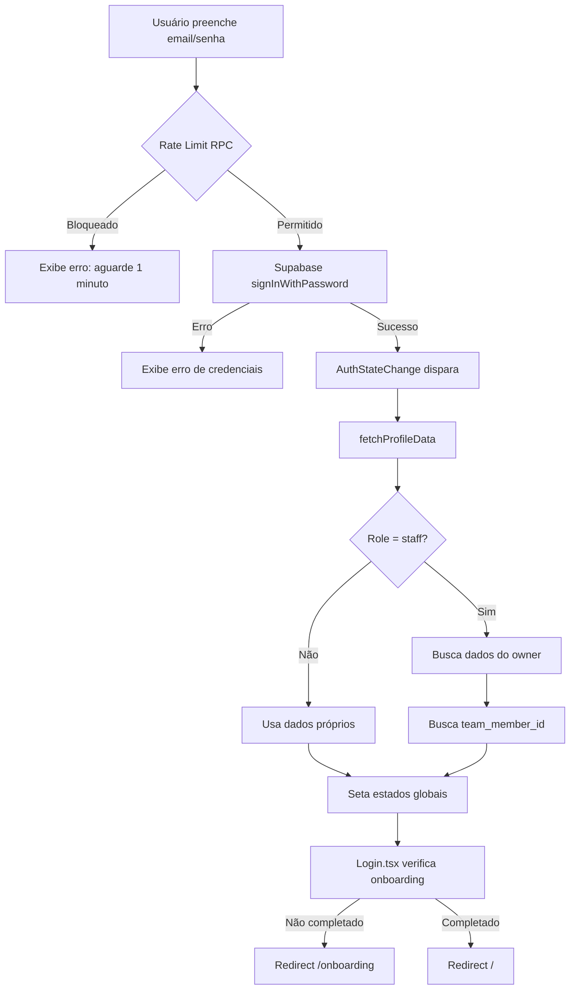
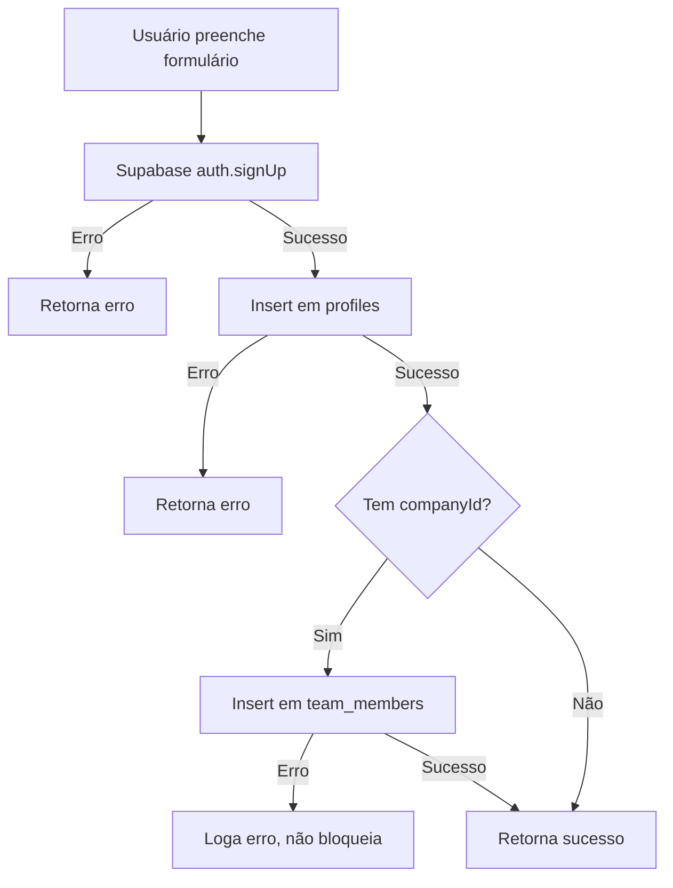
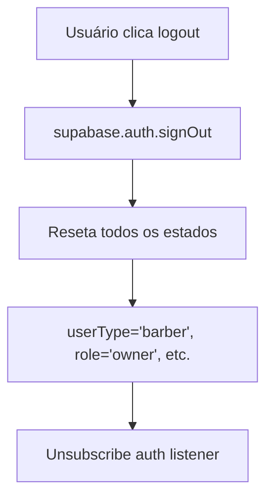
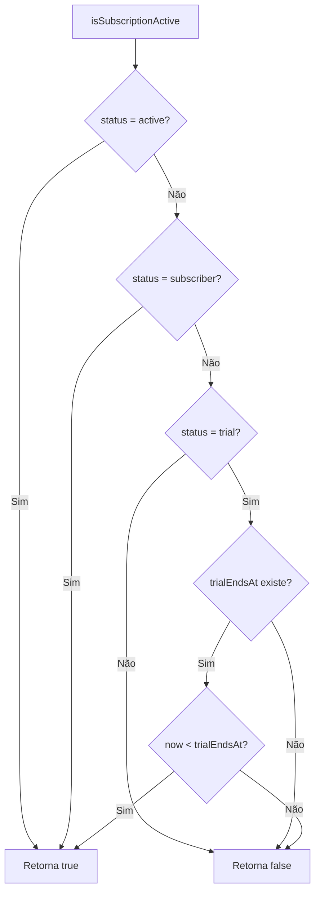
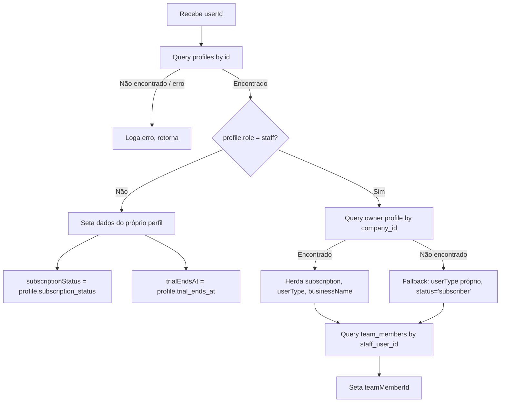

# Fluxogramas — Módulo: auth

> Gerado pelo Archaeologist em 2026-05-03
> Nível: Detalhado

---

## Fluxo: Login Completo

---

## Fluxo: Registro de Novo Usuário

---

## Fluxo: Logout

---

## Fluxo: Verificação de Assinatura Ativa

---

## Fluxo: fetchProfileData

