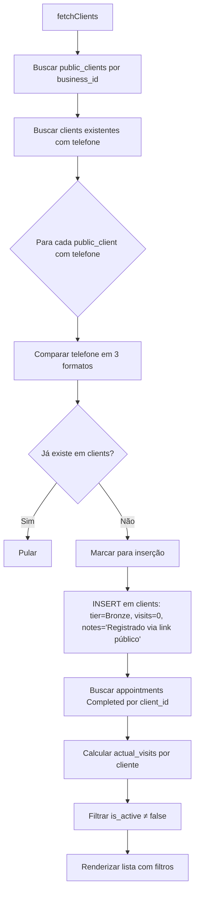
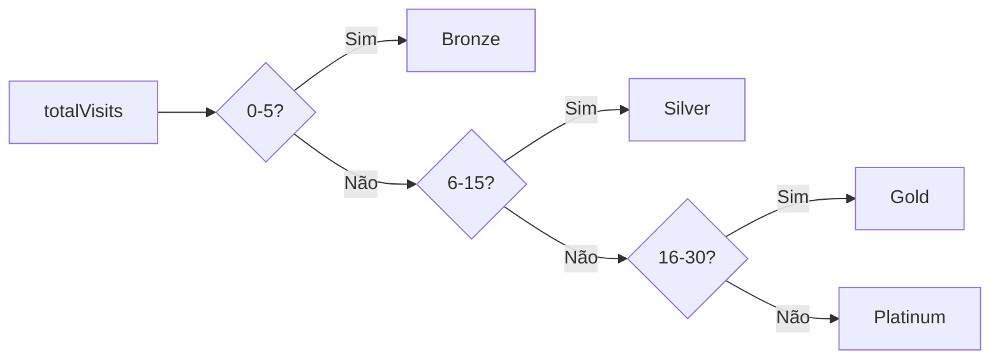
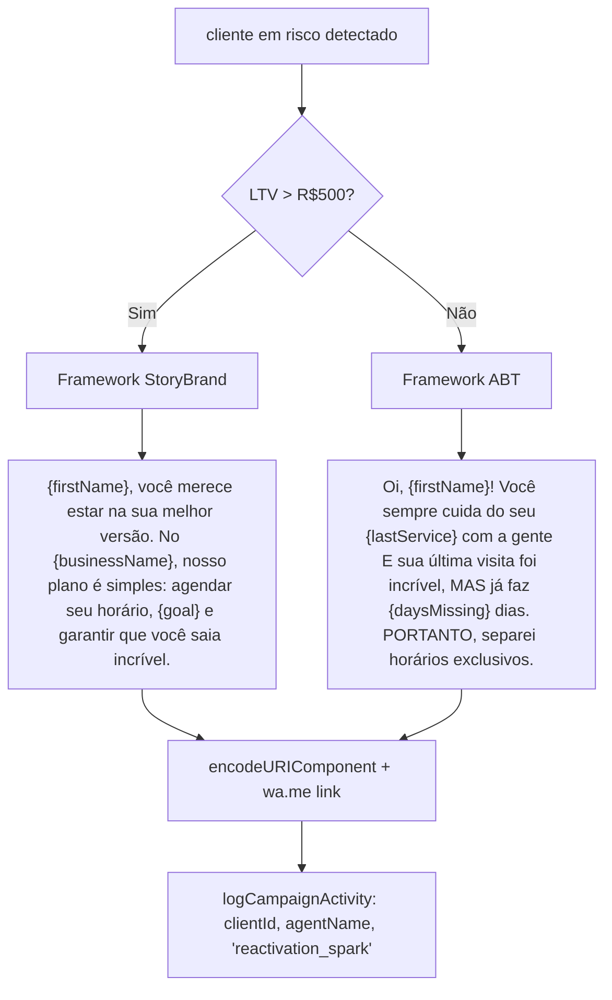
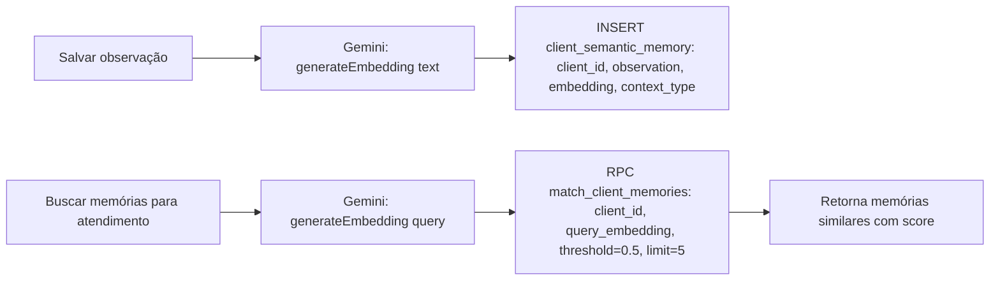
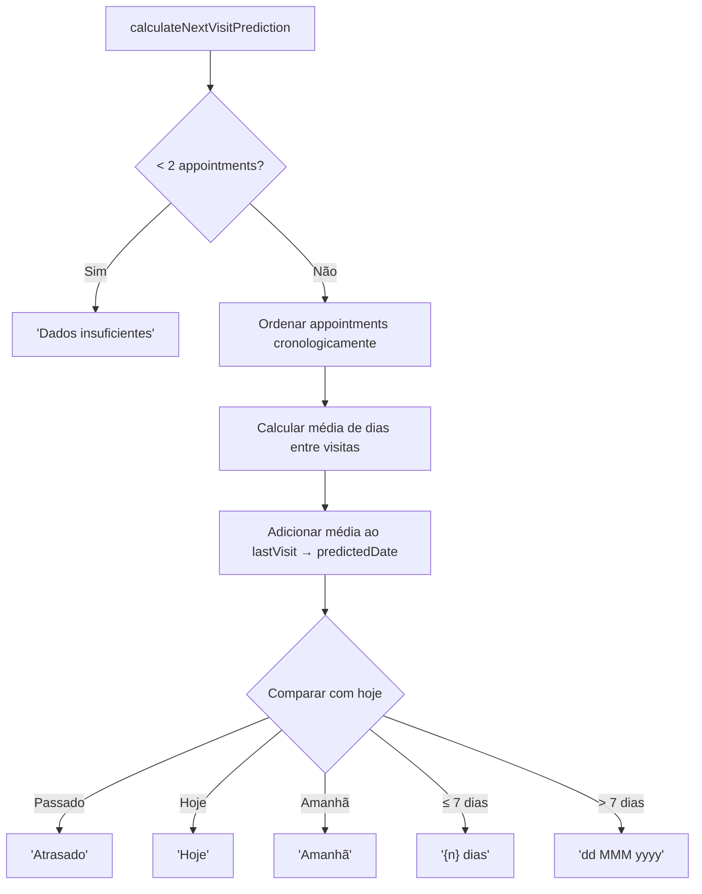

# Flowchart — clients/crm

> Gerado pelo Archaeologist em 2026-05-03
> Nível de documentação: **Detalhado**

---

## Fluxo Geral: Sincronização de Clientes



---

## Fluxo: Perfil do Cliente (ClientCRM)

```mermaid
flowchart TD
    A[Carregar página /clientes/:id] --> B[RPC get_client_profile]
    B --> C[Receber: client, ltv, appointments_history, hair_history]
    C --> D[Calcular totalVisits e lastVisit]
    D --> E[calculateNextVisitPrediction]
    E --> F{AIOS habilitado E cliente em risco?}
    F -->|Sim| G[Exibir card de reativação com botão WhatsApp]
    F -->|Não| H[Exibir AISemanticInsights com memórias]
    G --> I[handleWhatsAppClick → logCampaignActivity + generateReactivationMessage]
    H --> J[searchMemorías com query de preferências]
    
    K[Salvar notas] --> L{Salvar com memória semântica?}
    L -->|Sim| M[UPDATE clients.notes + saveMemory(embedding)]
    L -->|Não| N[UPDATE clients.notes]
```

---

## Fluxo: Sistema de Fidelidade (Tier)



---

## Fluxo: Autenticação do Cliente Público (ClientArea)

```mermaid
flowchart TD
    A[Cliente acessa /minha-area/:slug] --> B[Buscar business via slug]
    B --> C{Client já autenticado? via localStorage}
    C -->|Sim| D[Exibir área do cliente]
    C -->|Não| E[Exibir gate de telefone]
    E --> F[Inserir telefone]
    F --> G[RPC get_public_client_by_phone]
    G --> H{Encontrado?}
    H -->|Sim| I[Setar client no state + localStorage]
    H -->|Não| J[Exibir formulário de registro]
    J --> K[register: nome + email + telefone]
    K --> L[Verificar se já existe por phone]
    L --> M{Já existe?}
    M -->|Sim| N[UPDATE dados + espelhar para CRM]
    M -->|Não| O[INSERT em public_clients]
    O --> P[Espelhar para CRM via mirror_public_client_to_crm RPC]
    N --> P
    P --> Q[Setar client + localStorage → Exibir área]
    
    D --> R[fetchBookings: get_client_bookings_history]
    R --> S[Real-time subscription em public_bookings_{phone}]
    S --> T[Separar upcoming / history]
    T --> U[Renderizar tabs: Próximos / Histórico / Perfil]
```

---

## Fluxo: Detalhado — Mensagem de Reativação (AIOS)



---

## Fluxo: Memória Semântica (RAG)



---

## Fluxo: Previsão de Próxima Visita

