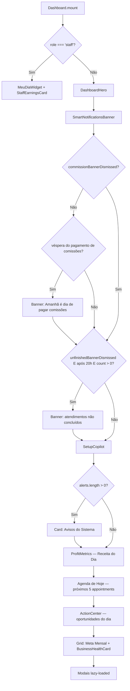
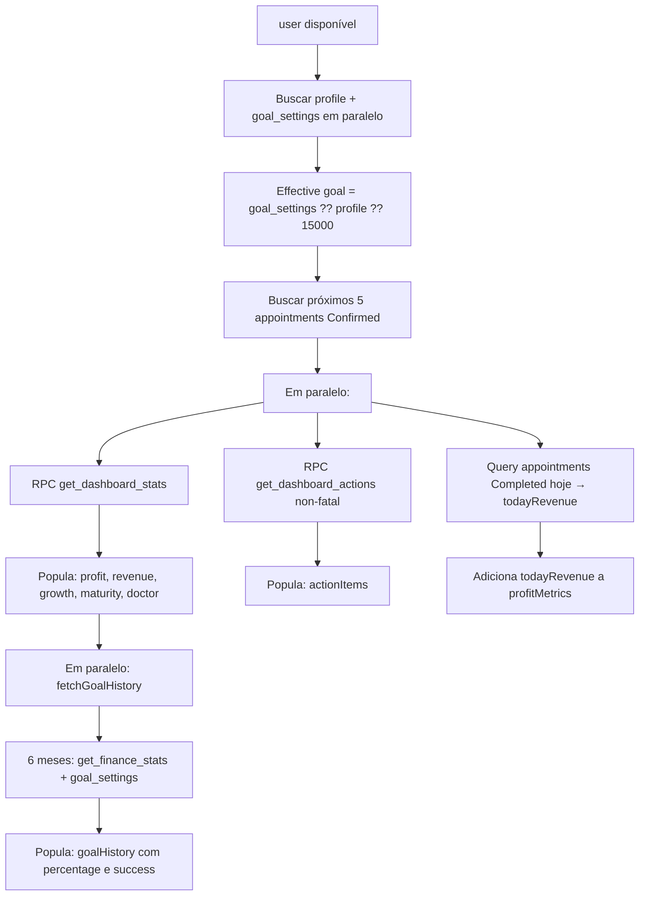
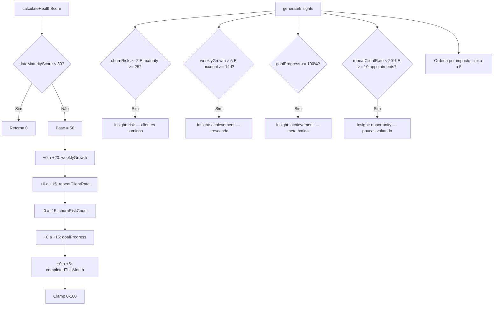
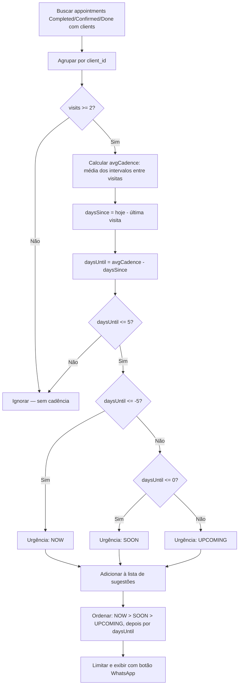
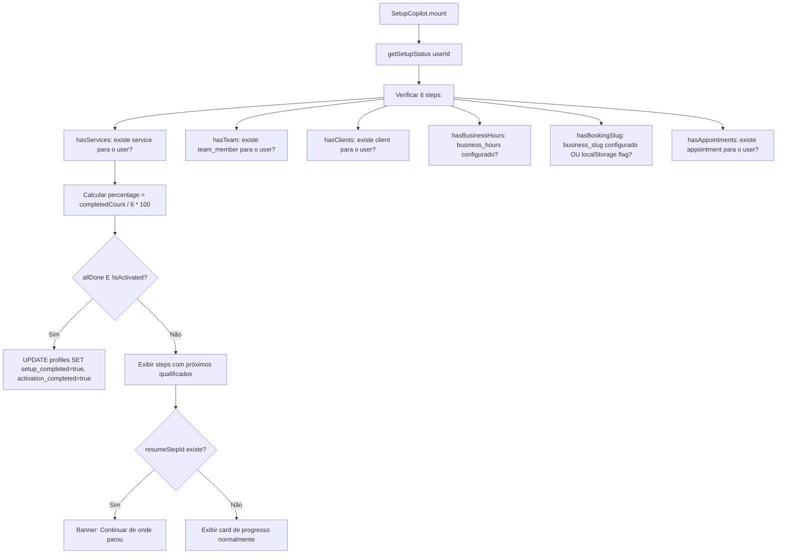
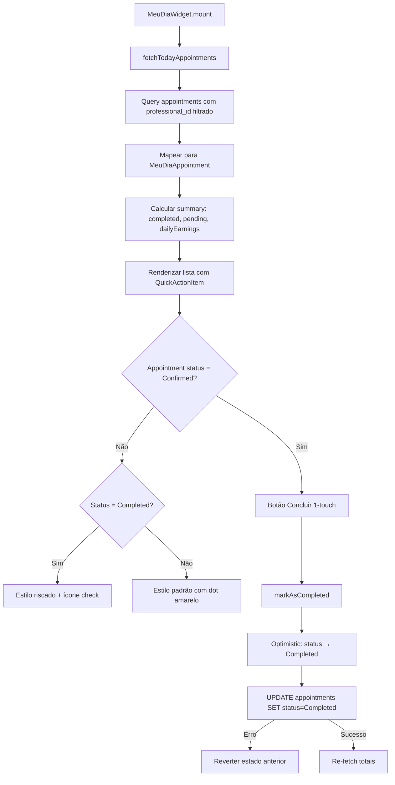
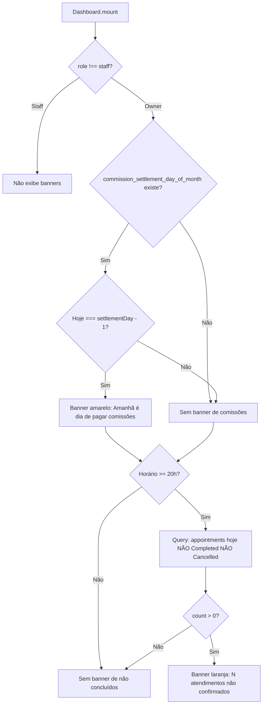

# Flowcharts — dashboard

> Gerado pelo Archaeologist em 2026-05-03
> Nível de documentação: **Detalhado**

---

## Fluxo Principal: Renderização do Dashboard

---

## Fluxo: useDashboardData — Busca de Dados

---

## Fluxo: Financial Doctor — Score e Insights

---

## Fluxo: Smart Rebooking — Cadência Preditiva

---

## Fluxo: Setup Copilot — Progresso

---

## Fluxo: MeuDiaWidget — Staff

---

## Fluxo: Banners Contextuais

