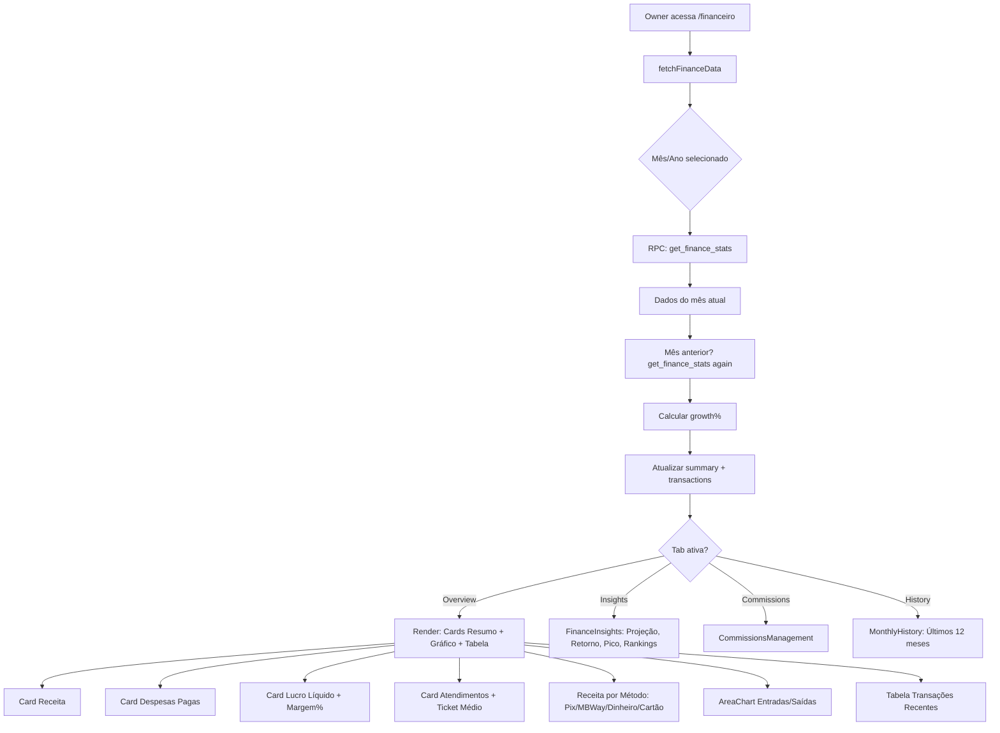
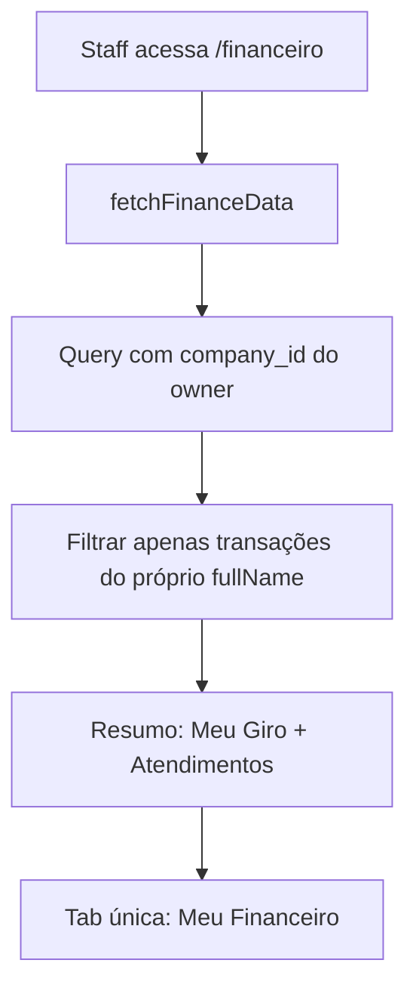
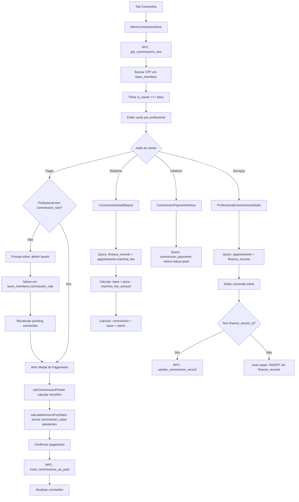
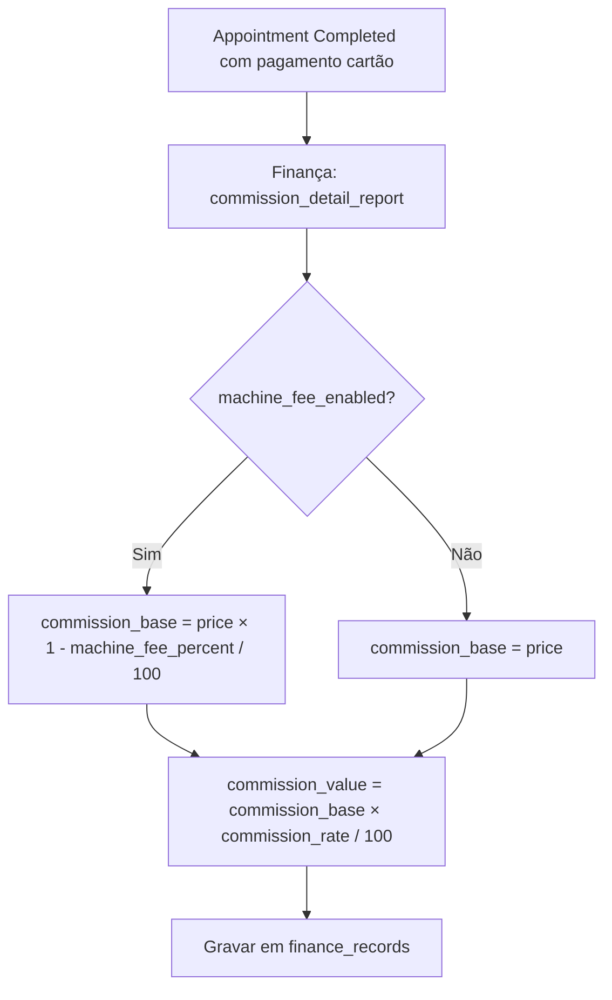
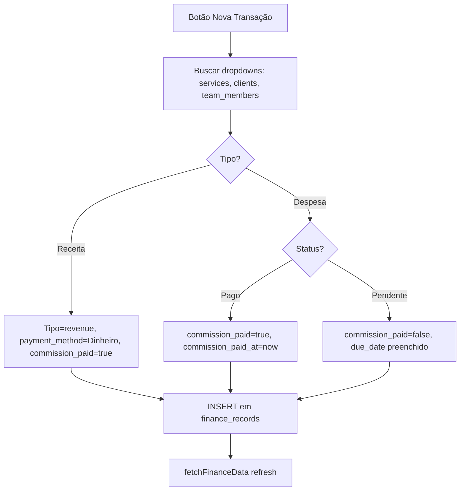
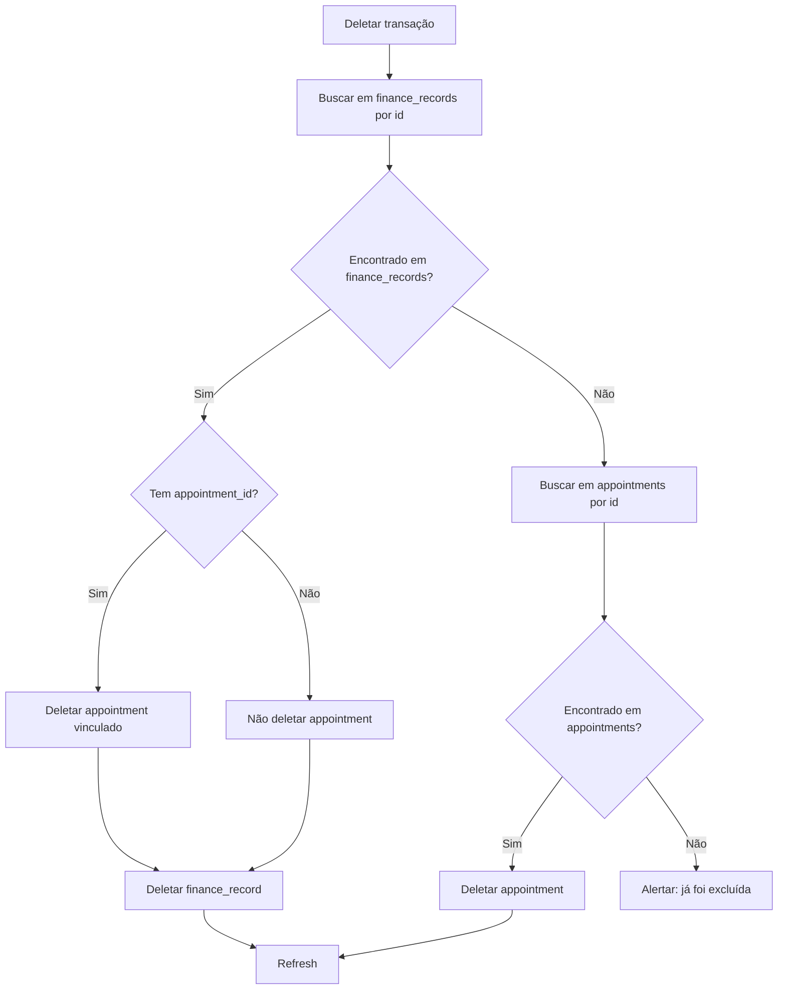
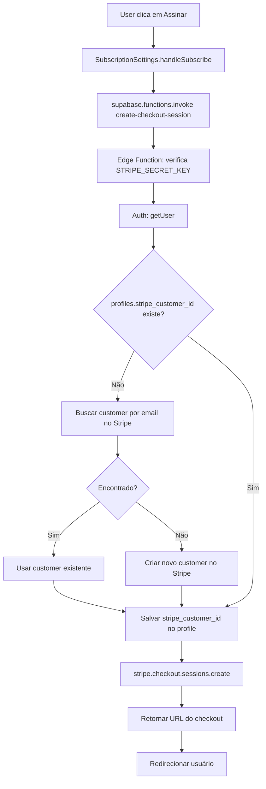
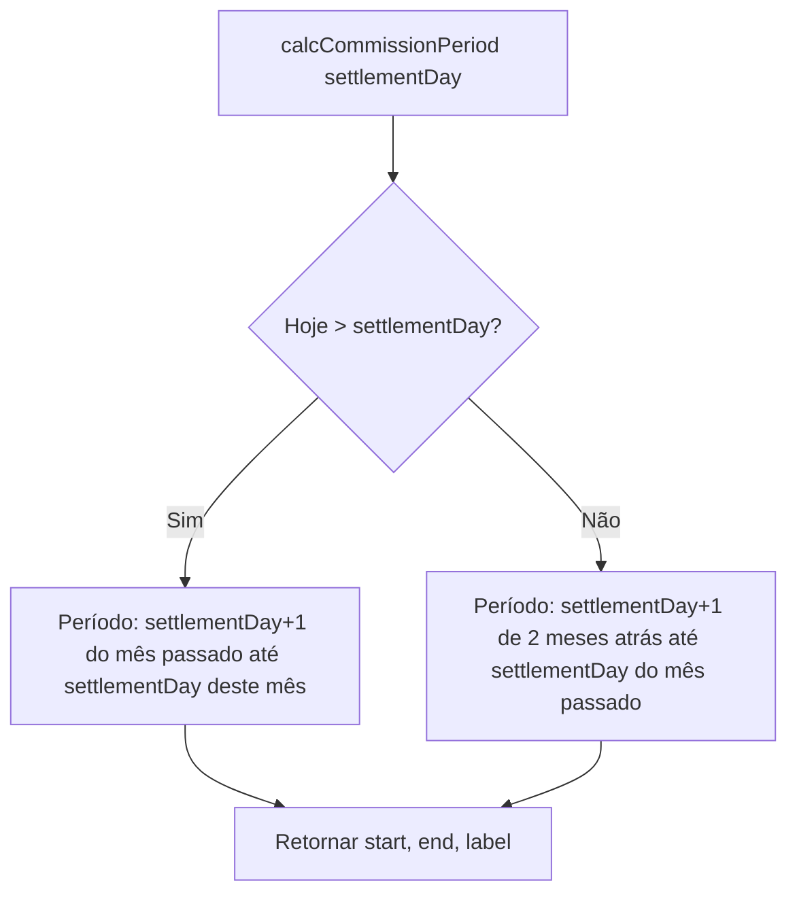
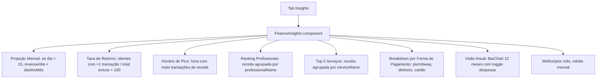

# Fluxograma — Módulo finance

> Gerado pelo Archaeologist em 2026-05-03
> Nível de documentação: **Detalhado**

---

## Fluxo Principal — Finance (Owner)

---

## Fluxo Principal — Finance (Staff)

---

## Fluxo — Gestão de Comissões

---

## Fluxo — Comissão com Maquininha

---

## Fluxo — Nova Transação Manual

---

## Fluxo — Deletar Transação

---

## Fluxo — Assinatura Stripe

---

## Fluxo — Período de Acerto (calcCommissionPeriod)

---

## Fluxo — Insights Financeiros

