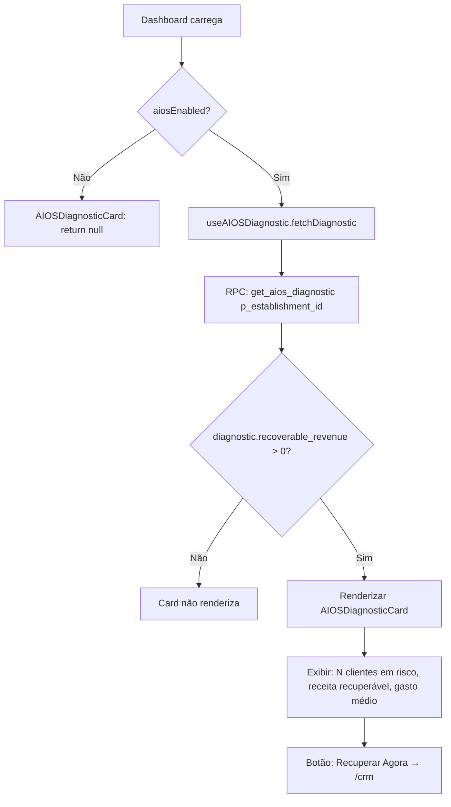
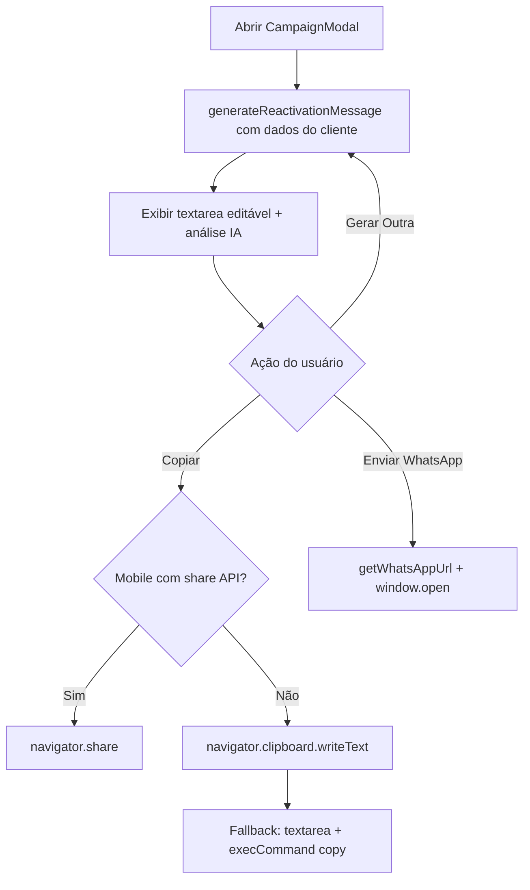
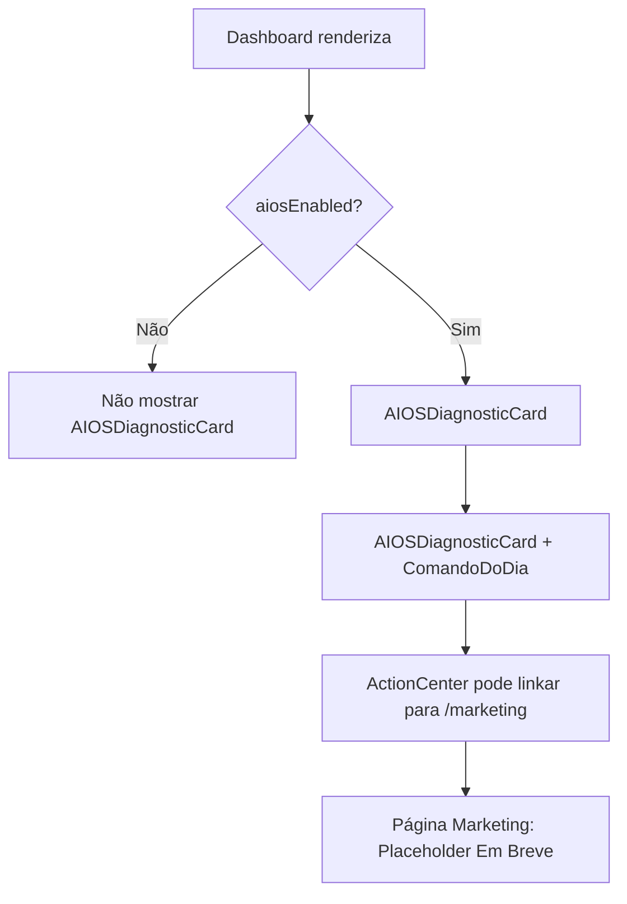
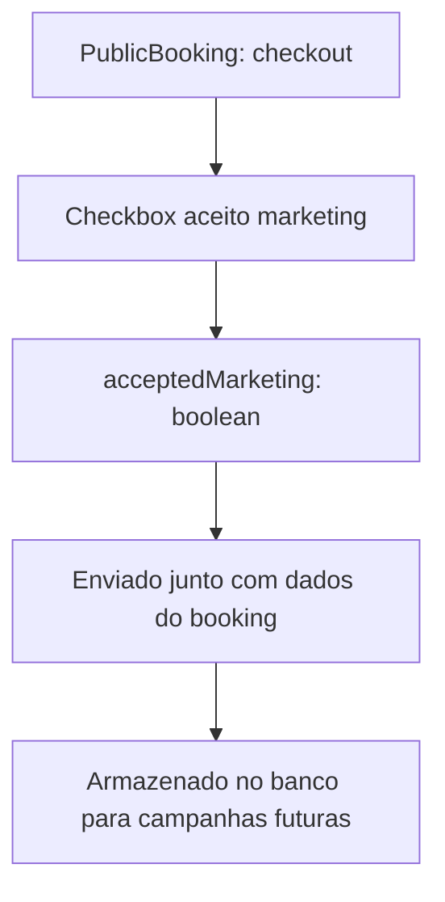

# Fluxograma — Módulo marketing / AIOS

> Gerado pelo Archaeologist em 2026-05-03
> Nível de documentação: **Detalhado**

---

## Fluxo Principal — AIOS Diagnostic



---

## Fluxo — Reativação via ChurnRadar

```mermaid
flowchart TD
    A[ClientCRM carrega ChurnRadar] --> B[Lista de clientes at_risk do diagnostic]
    B --> C[Renderizar card por cliente: nome, dias ausente, avg_ticket]
    C --> D{Owner clica Chamar de volta}
    D --> E[generateReactivationMessage: contexto do cliente]
    E --> F{ltv > 500?}
    F -->|Sim| G[applyStoryBrand:-framework herói/guia]
    F -->|Não| H[applyABT:framework And-But-Therefore]
    G --> I[encodeURIComponent mensagem]
    H --> I
    I --> J[logCampaignActivity client_id, AIOSMarketingAgent, whatsapp_reactivation]
    J --> K[RPC: log_aios_campaign]
    K --> L[getWhatsAppUrl: wa.me/{cleanPhone}?text={message}]
    L --> M[Abrir WhatsApp em nova aba]
```

---

## Fluxo — CampaignModal



---

## Fluxo — AIOS no Dashboard



---

## Fluxo — Marketing Opt-in no Booking Público

