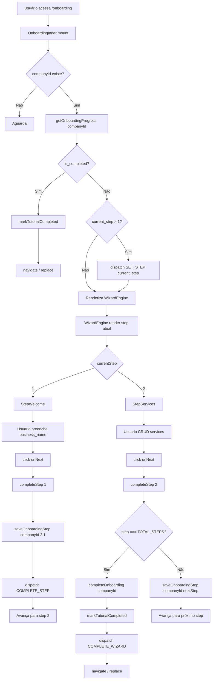
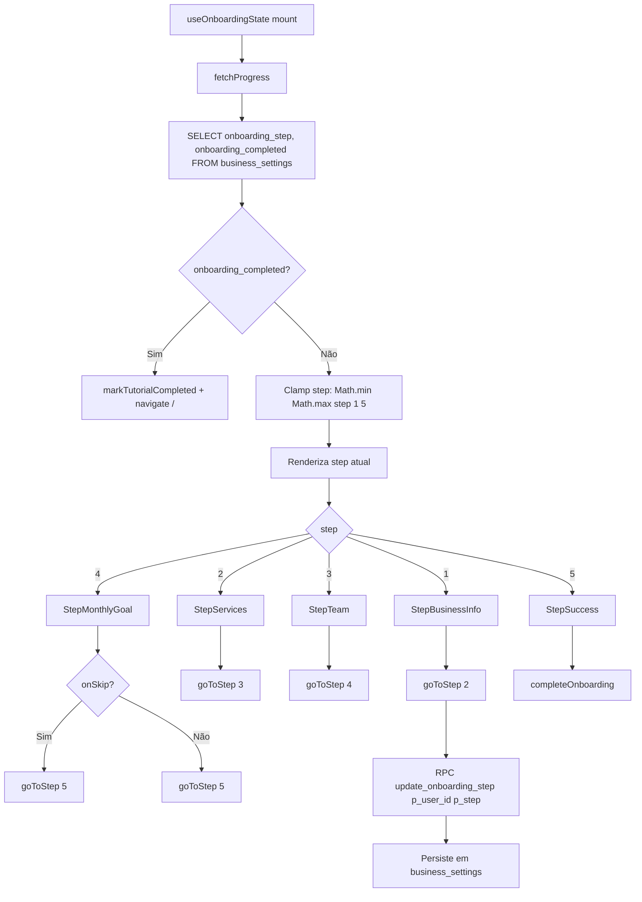
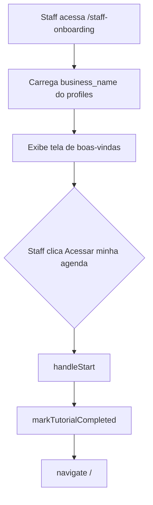
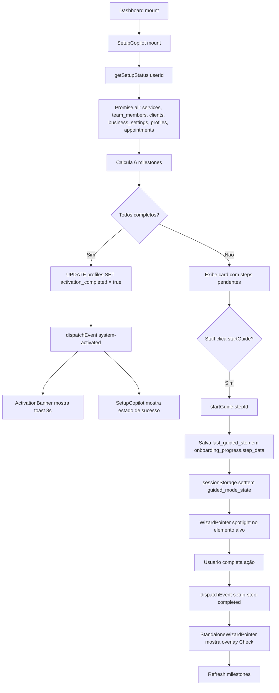
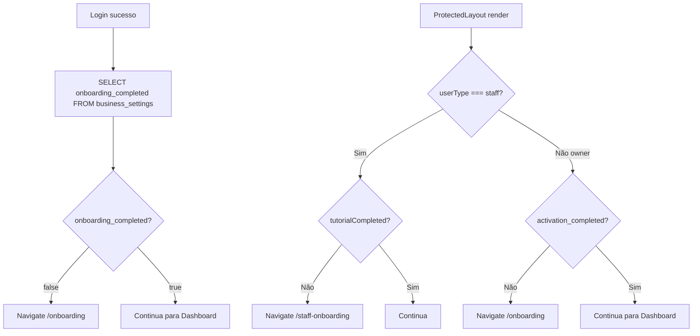
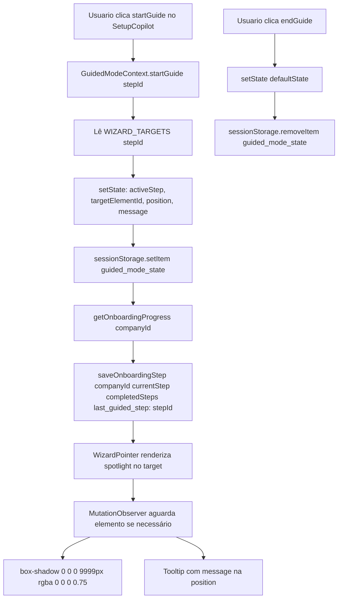

# Fluxogramas — Módulo onboarding

> Gerado pelo Archaeologist em 2026-05-03
> Nível: Detalhado

---

## 1. Fluxo Principal — Wizard Novo (Onboarding.tsx)



---

## 2. Fluxo — Wizard Legado (OnboardingWizard.tsx)



---

## 3. Fluxo — Staff Onboarding



---

## 4. Fluxo — SetupCopilot (Pós-wizard)



---

## 5. Fluxo — Redirect Guards



---

## 6. Fluxo — Guided Mode (Context)



---

## 7. Fluxo — Persistência (RPCs)

```mermaid
flowchart TD
    subgraph Novo Sistema
        A1[saveOnboardingStep] --> B1[RPC upsert_onboarding_progress]
        B1 --> C1[Valida company_id do chamador]
        C1 --> D1{match?}
        D1 -->|Não| E1[RAISE EXCEPTION insufficient_privilege]
        D1 -->|Sim| F1[INSERT ... ON CONFLICT company_id DO UPDATE]
        F1 --> G1[step_data merge: existing || new]
        G1 --> H1[RETURN onboarding_progress]
    end

    subgraph Sistema Legado
        A2[useOnboardingState.goToStep] --> B2[RPC update_onboarding_step]
        B2 --> C2[INSERT INTO business_settings onboarding_step onboarding_completed]
        C2 --> D2[ON CONFLICT user_id DO UPDATE]
        D2 --> E2[onboarding_step = GREATEST atual novo]
        E2 --> F2[onboarding_completed = true se p_completed ELSE mantém]
    end
```