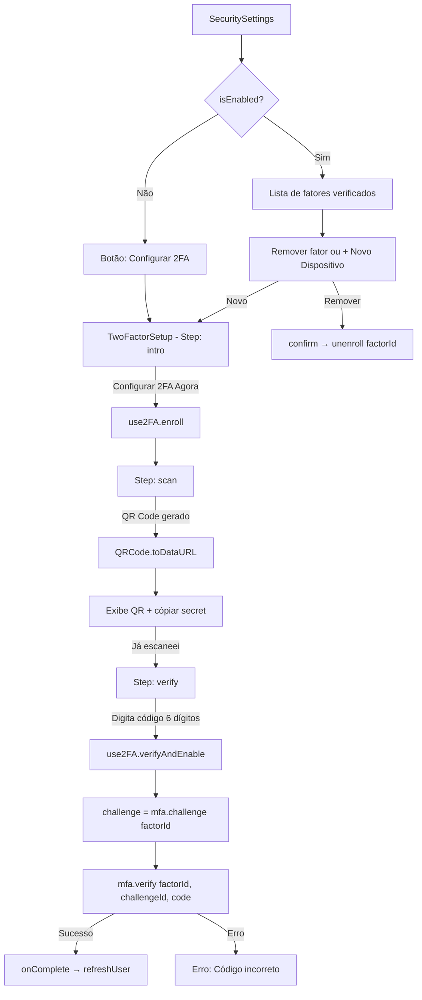
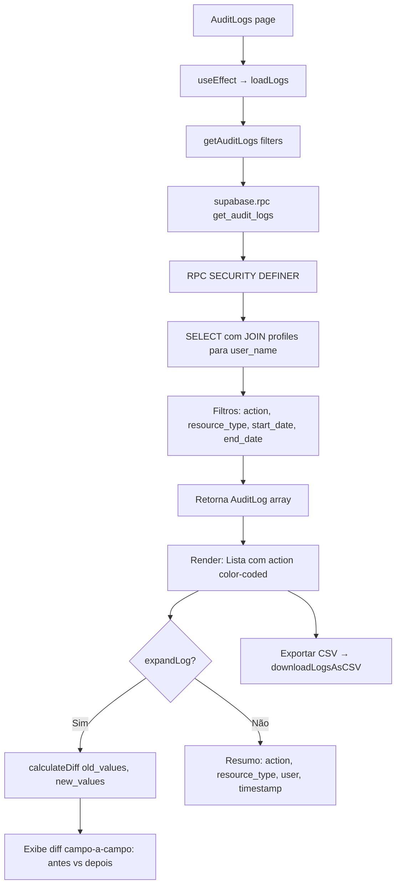
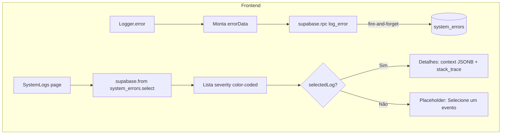
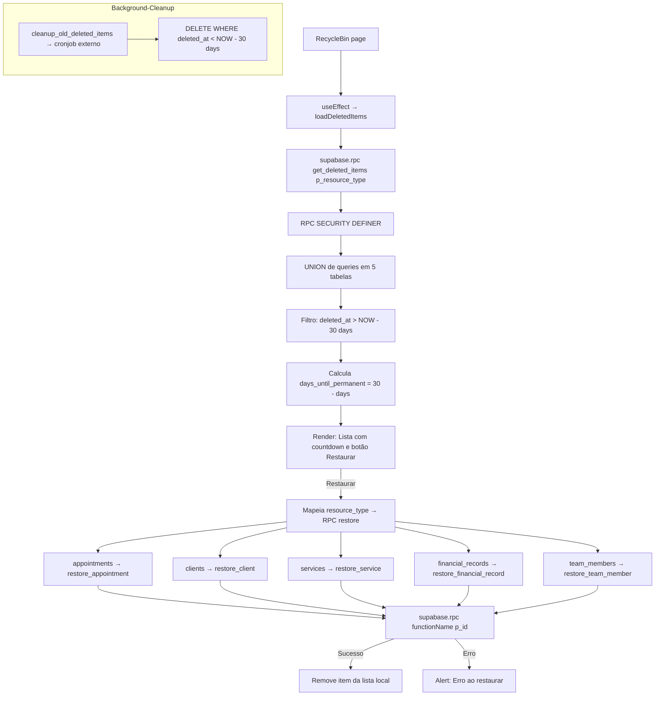
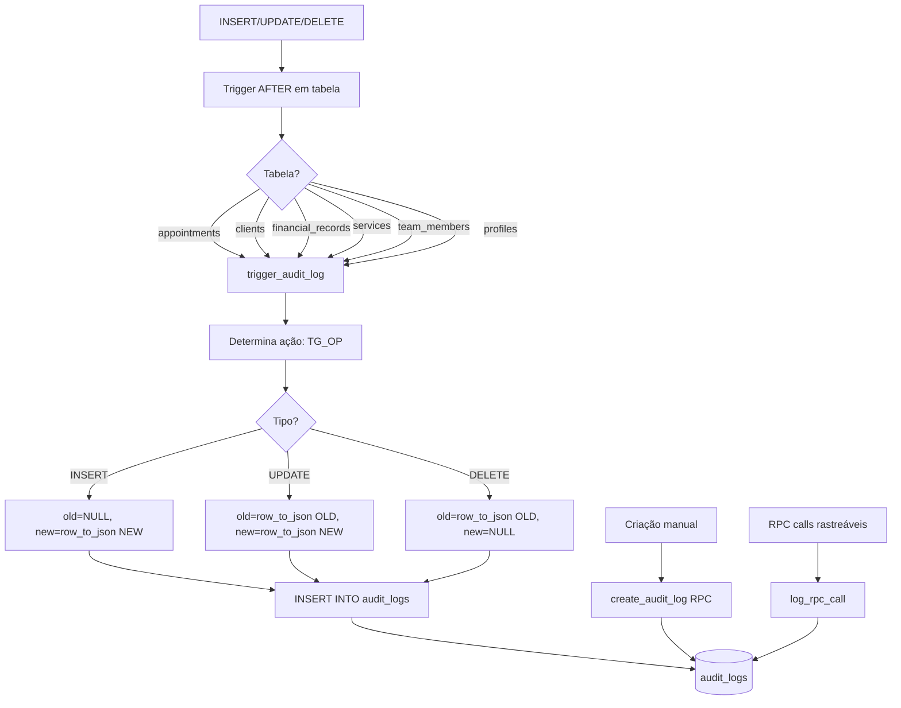
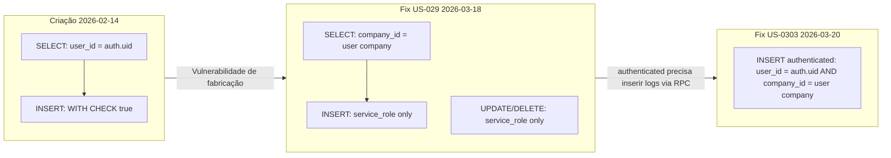
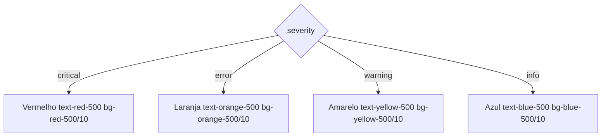

# Flowchart — security/audit

> Gerado pelo Archaeologist em 2026-05-04
> Nível: Detalhado

---

## 1. 2FA Setup Flow

## 2. Audit Logs — Busca e Visualização

## 3. System Errors — Logging e Visualização

## 4. Soft Delete / Lixeira

## 5. Audit Trail — Trigger Automático

## 6. RLS — Audit Logs (Evolução)

## 7. SystemError Severity Display

