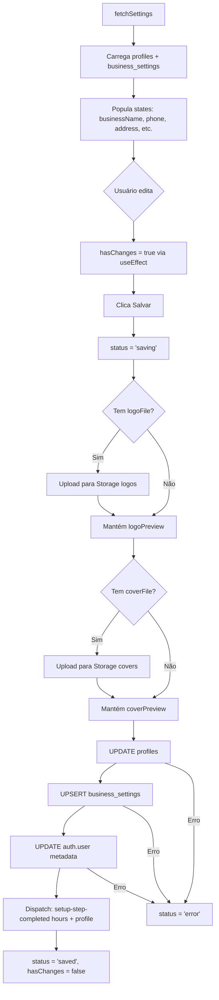
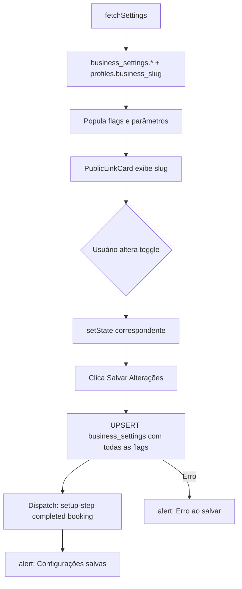
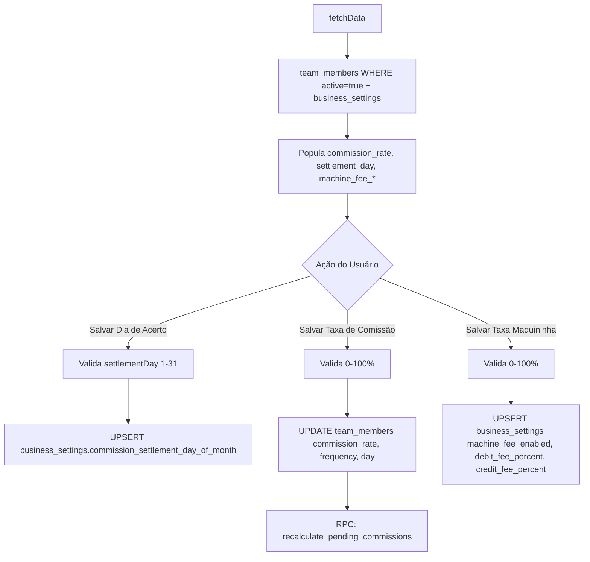
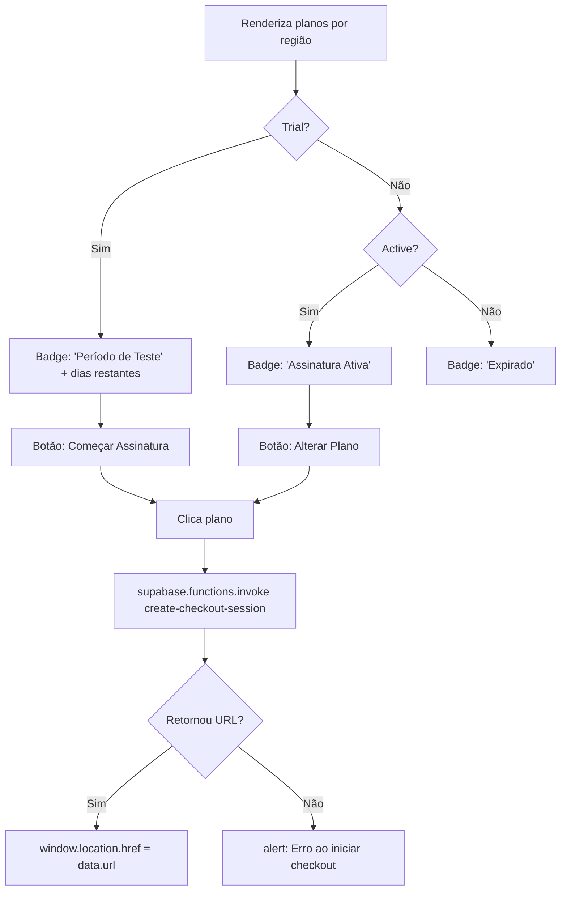
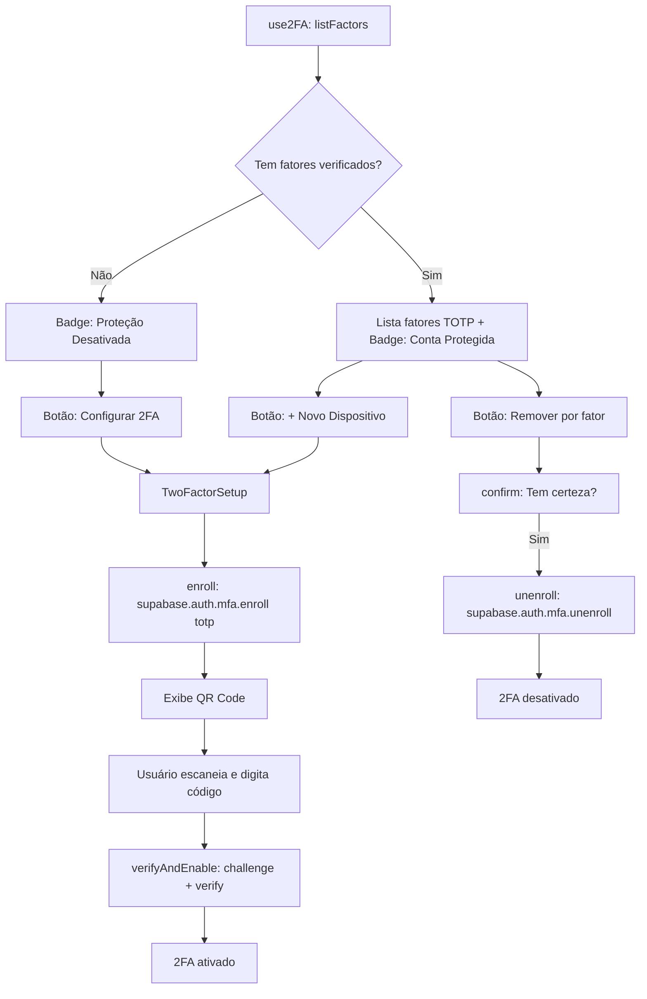
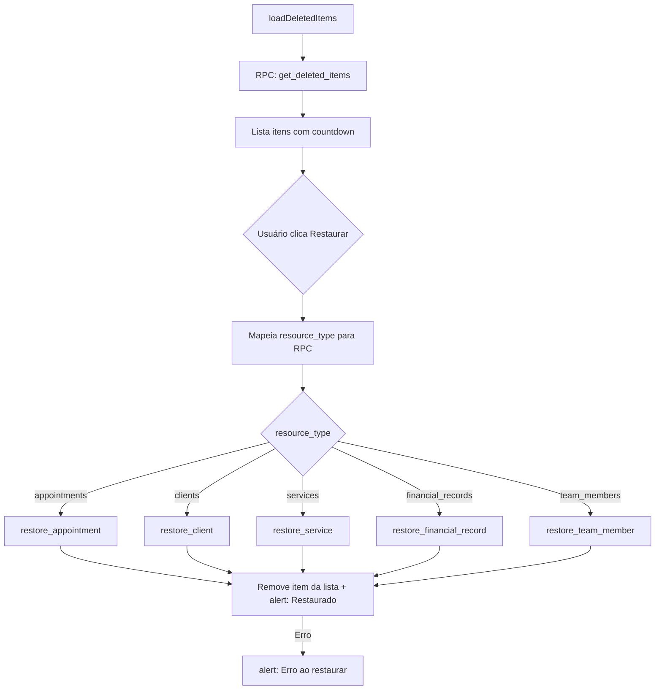
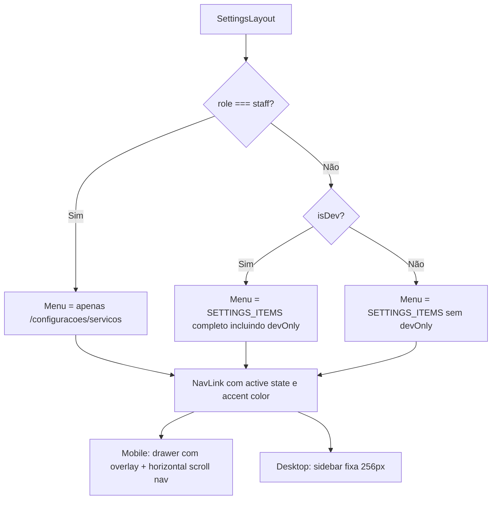
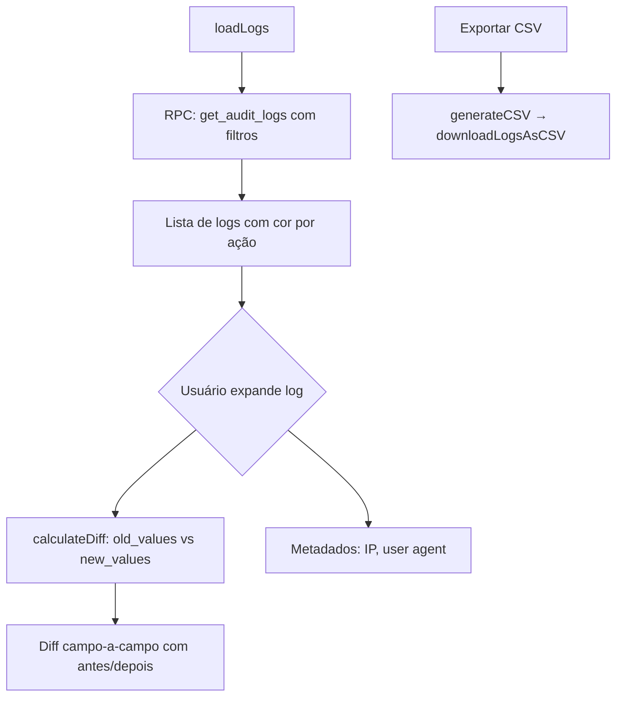
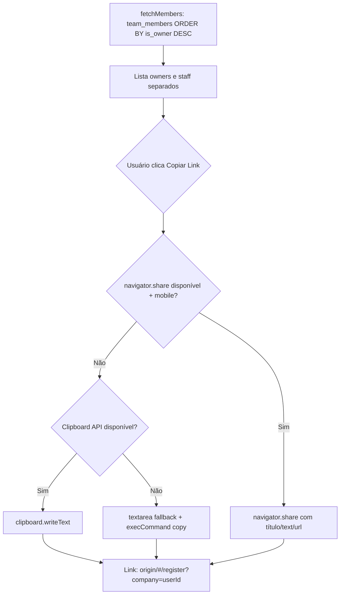

# Flowcharts — Módulo settings

> Gerado pelo Archaeologist em 2026-05-04
> Nível de documentação: **Detalhado**

---

## Visão Geral do Módulo

```mermaid
graph TD
    SL[SettingsLayout] --> GS[GeneralSettings]
    SL --> PBS[PublicBookingSettings]
    SL --> TS[TeamSettings]
    SL --> SS[ServiceSettings]
    SL --> CS[CommissionsSettings]
    SL --> FinS[FinancialSettings]
    SL --> SubS[SubscriptionSettings]
    SL --> SecS[SecuritySettings]
    SL --> AL[AuditLogs]
    SL --> RB[RecycleBin]
    SL --> SysL[SystemLogs]

    GS -->|WRITE| profiles
    GS -->|WRITE| business_settings
    GS -->|UPLOAD| Storage logos/covers

    PBS -->|READ/WRITE| business_settings
    PBS -->|READ| profiles.business_slug

    TS -->|READ/WRITE| team_members

    SS -->|CRUD| services
    SS -->|CRUD| service_categories

    CS -->|READ/WRITE| team_members
    CS -->|READ/WRITE| business_settings
    CS -->|RPC| recalculate_pending_commissions

    FinS -->|READ/WRITE| business_settings

    SubS -->|RPC| create-checkout-session
    SubS -->|READ| profiles.subscription_status

    SecS -->|AUTH| MFA TOTP
    SecS -->|hook| use2FA

    AL -->|RPC| get_audit_logs
    AL -->|EXPORT| downloadLogsAsCSV

    RB -->|RPC| get_deleted_items
    RB -->|RPC| restore_appointment/restore_client/etc

    SysL -->|READ| system_errors
```

---

## Fluxo: GeneralSettings - Salvamento



---

## Fluxo: PublicBookingSettings - Persistência



---

## Fluxo: CommissionsSettings - Taxa e Acerto



---

## Fluxo: SubscriptionSettings - Checkout Stripe



---

## Fluxo: SecuritySettings - 2FA



---

## Fluxo: RecycleBin - Restauração



---

## Fluxo: SettingsLayout - RBAC e Menu



---

## Fluxo: AuditLogs - Consulta e Diff



---

## Fluxo: TeamSettings - Convite

