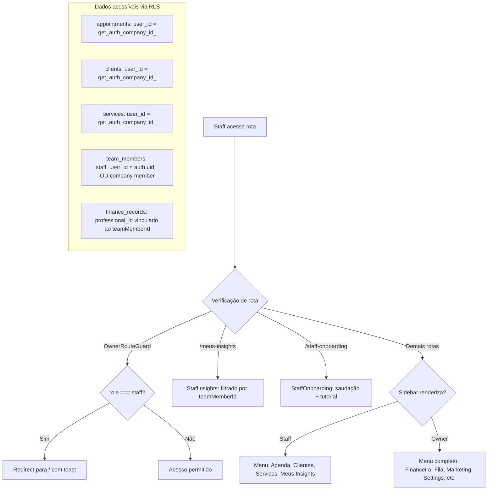
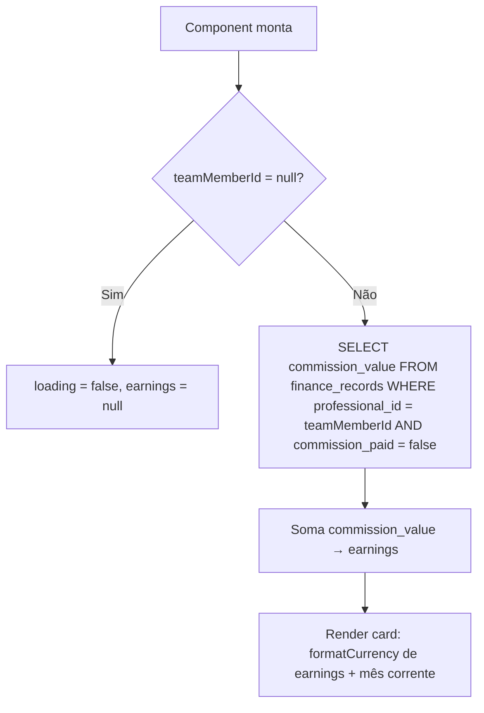
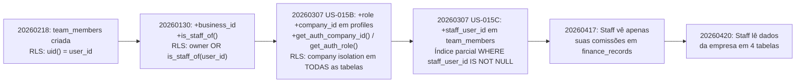

# Fluxogramas — Módulo: staff/team

> Gerado pelo Archaeologist em 2026-05-03
> Nível: Detalhado

---

## Fluxo: Cadastro de Profissional pelo Owner

```mermaid
flowchart TD
    A[Owner clica "+ Profissional"] --> B[TeamMemberForm abre]
    B --> C{Tipo de cadastro?}
    C -->|"Sou eu quem atende"| D[Auto-preenche: name, role, photo, commission_rate=100, is_owner=true]
    C -->|"Novo profissional"| E[Formulário vazio: is_owner=false]
    D --> F[Preenche campos restantes]
    E --> F
    F --> G{Têm foto?}
    G -->|Sim| H[Upload para team_photos bucket]
    G -->|Não| I[photo_url = null]
    H --> J[Monta teamMemberData]
    I --> J
    J --> K{Editando ou criando?}
    K -->|Editando| L[UPDATE team_members WHERE id AND user_id]
    K -->|Criando| M[INSERT em team_members]
    L --> N[Evento setup-step-completed]
    M --> N
    N --> O[fetchMembers → atualiza lista]
```

---

## Fluxo: Convite e Registro de Staff (Link Compartilhável)

```mermaid
flowchart TD
    A[Owner clica "Copiar Link de Convite"] --> B[Gera URL: origin/#/register?company=ownerId]
    B --> C{Tentativa de compartilhamento}
    C -->|Mobile com Web Share API| D[navigator.share com título e mensagem]
    C -->|Desktop/navegador| E[Clipboard API]
    E -->|Fallback| F[textarea + execCommand copy]
    D --> G[Link enviado ao staff]
    E --> G
    F --> G
    G --> H[Staff acessa o link]
    H --> I[Register.tsx detecta companyId na URL]
    I --> J[isInvitedStaff = true]
    J --> K[RPC get_company_for_invite → business_name, user_type]
    K --> L[Staff preenche nome, email, senha]
    L --> M[supabase.auth.signUp]
    M -->|Erro| N[Retorna erro ao usuário]
    M -->|Sucesso| O[INSERT em profiles: role=staff, company_id=companyId]
    O --> P[INSERT em team_members: user_id=companyId, staff_user_id=auth.user.id, name, commission_rate=0, active=true, is_owner=false]
    P -->|Erro| Q[Loga erro mas NÃO bloqueia]
    P -->|Sucesso| R[Redirect /staff-onboarding]
```

---

## Fluxo: Login de Staff — Busca de teamMemberId

```mermaid
flowchart TD
    A[Staff faz login] --> B[AuthStateChange dispara]
    B --> C[fetchProfileData]
    C --> D[Busca profile → role=staff]
    D --> E[Busca dados do owner: profiles WHERE id=companyId]
    E --> F[Herda: subscriptionStatus, trialEndsAt, userType, businessName]
    F --> G[Busca teamMemberId: SELECT id FROM team_members WHERE staff_user_id=userId AND user_id=companyId]
    G --> H{teamMemberId encontrado?}
    H -->|Sim| I[Seta teamMemberId no estado global]
    H -->|Não| J[teamMemberId = null → "Vinculação pendente"]
    I --> K[Verifica onboarding_completed]
    J --> K
    K -->|Não completou| L[Redirect /staff-onboarding]
    K -->|Completou| M[Redirect / → Dashboard com MeuDiaWidget]
```

---

## Fluxo: Acesso de Staff — RLS e Permissões



---

## Fluxo: Insights do Staff (Meus Resultados)

```mermaid
flowchart TD
    A[Staff acessa /meus-insights] --> B{role === owner?}
    B -->|Sim| C[Redirect para /insights]
    B -->|Não| D{teamMemberId = null?}
    D -->|Sim| E[Exibe "Vinculação pendente"]
    D -->|Não| F[Busca paralela: 3 queries]
    F --> G[appointments WHERE professional_id = teamMemberId AND período]
    F --> H[appointments do dia WHERE status IN Confirmed/Pending]
    F --> I[finance_records do período]
    G --> J[Calcula completedCount]
    H --> K[Lista de agendamentos de hoje]
    I --> L[Soma comissões]
    J --> M[Render cards: Atendimentos, Clientes Únicos, Comissões]
    K --> N[Render "Próximos Hoje"]
    M --> O[Top Serviços: agrupa por nome, top 5]
    N --> O
```

---

## Fluxo: Comissões Pendentes (StaffEarningsCard)



---

## Fluxo: 1-Touch Complete (MeuDiaWidget — Staff)

```mermaid
flowchart TD
    A[Staff clica botão "Completar"] --> B[Optimistic update: status → Completed]
    B --> C[UPDATE appointments SET status=Completed WHERE id]
    C -->|Sucesso| D[Recalcula resumo: completed++, earnings+= price]
    C -->|Erro| E[Rollback: reverte estado local]
```

---

## Fluxo: Evolução das Políticas RLS (Migrations)

