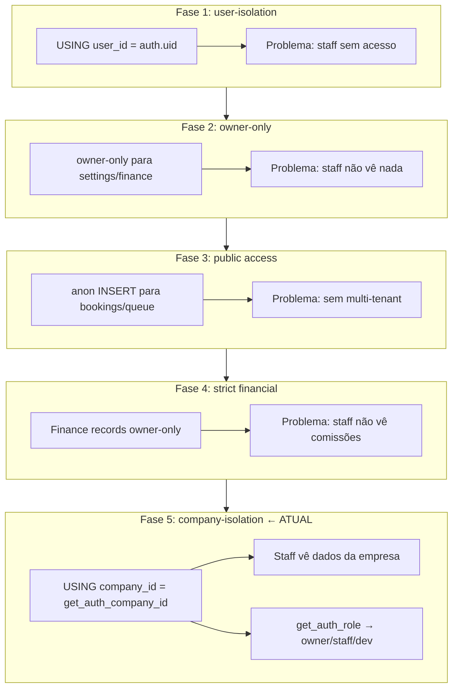
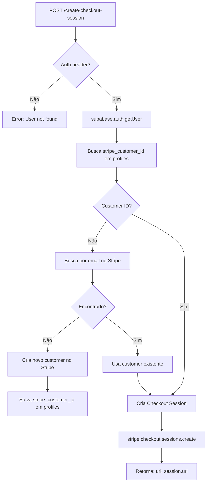
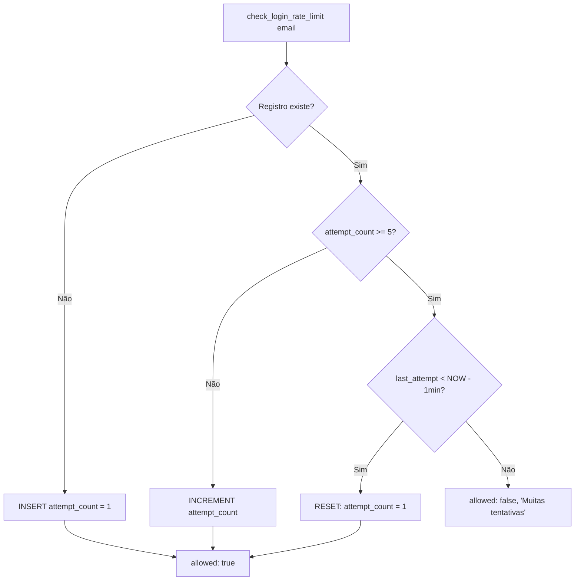
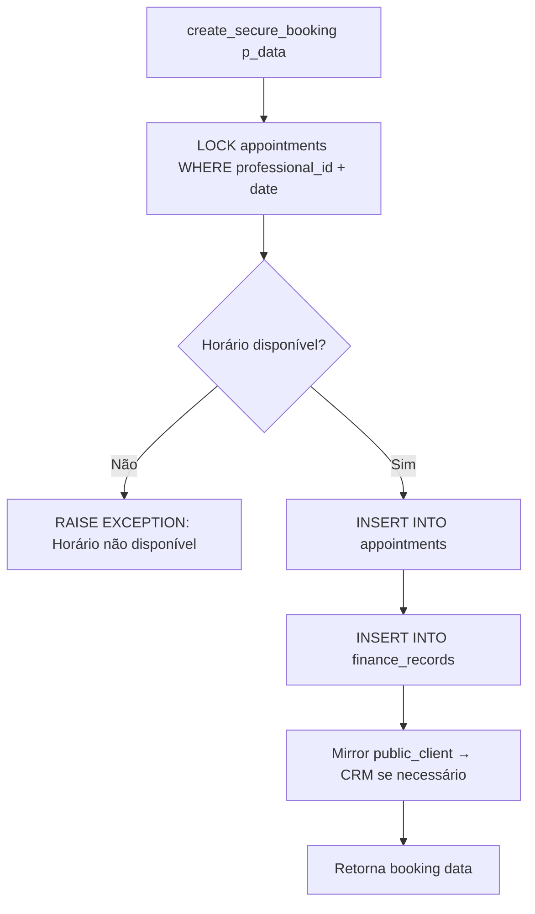
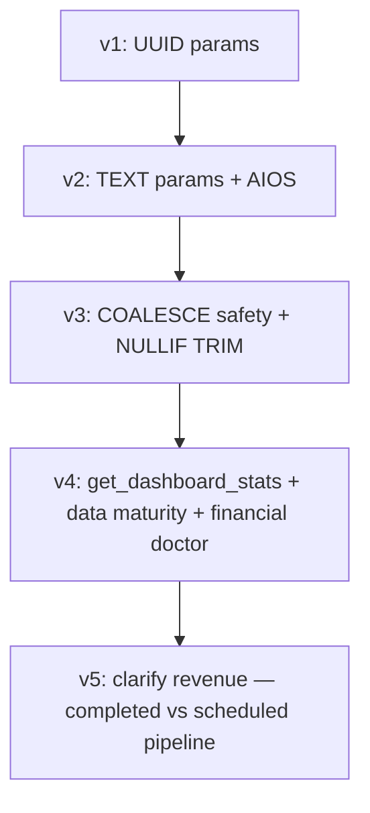

# Flowchart — supabase-backend

> Gerado pelo Archaeologist em 2026-05-04
> Nível: Detalhado

---

## 1. RLS Evolution — 5 Fases



## 2. Stripe Checkout (Edge Function)



## 3. Appointment Reminder (Edge Function)

```mermaid
flowchart TD
    A[Cron → send-appointment-reminder] --> B[Busca bookings confirmados para amanhã]
    B --> C[Filtra: enable_email_reminders = true]
    C --> D{Bookings encontrados?}
    D -->|Não| E[Retorna: No bookings to remind]
    D -->|Sim| F[Para cada booking]
    F --> G[Extrai: clientEmail, clientName, serviceName, businessName]
    G --> H{Tem email?}
    H -->|Não| I[Skipped: no email]
    H -->|Sim| J[Gera HTML template]
    J --> K[resend.emails.send]
    K --> L{Sucesso?}
    L -->|Não| M[Status: failed]
    L -->|Sim| N[Status: sent]
    M & N & I --> O[Retorna: results[]]
```

## 4. Rate Limiting Token Bucket



## 5. Secure Booking Flow (create_secure_booking)



## 6. Finance Stats Evolution (5 versões)



## 7. Dashboard Actions Pipeline

```mermaid
flowchart TD
    A[get_dashboard_actions] --> B[Comissões pendentes]
    A --> C[Bookings não confirmados]
    A --> D[Clientes em risco — churn]
    A --> E[Progresso da meta mensal]
    A --> F[Calendário de conteúdo]
    B & C & D & E & F --> G[Ordena por prioridade]
    G --> H[Retorna recommended_actions[]]
```