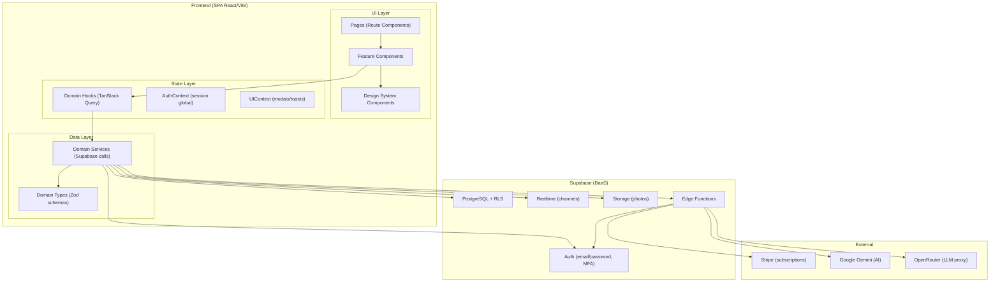

# Target Architecture

> Arquitetura alvo do AgendiX v1, desenhada para Strangler Fig por dominio com paradigma funcional leve.

## Visao geral

SPA React (Vite) com Supabase como BaaS, mantendo a mesma stack. A arquitetura migra de "componentes monoliticos com logica embutida" para "camadas separadas por dominio": services (chamadas), hooks (server state via TanStack Query), types (schemas Zod) e componentes focados. O banco mantido e Supabase PostgreSQL com RLS multi-tenant. Edge Functions para Stripe e operacoes server-side sensiveis.

## Diagrama

> Regra de seguranca: o frontend nao chama Gemini/OpenRouter diretamente quando houver API key/secret. IA que dependa de chave deve passar por Edge Function/backend. Funcionalidades de IA avancada permanecem pos-v1/beta se aumentarem risco, custo ou complexidade.

## Bounded Contexts

### BC-1: Identity (Auth + Perfil + Onboarding)

- **Responsabilidade**: autenticacao, sessao, perfis, trial, assinatura, onboarding, roles
- **Justificativa**: coesao alta -- login, perfil, trial e onboarding sao invariantes acopladas (nao existe sessao sem perfil; onboarding gate depende de perfil)
- **Tabelas**: profiles, business_settings, onboarding_progress
- **Regras migradas**: BR-MIGRAR-001 a 010, 048-050
- **Fase**: 1

### BC-2: Scheduling (Agenda + Checkout)

- **Responsabilidade**: CRUD de agendamentos, checkout com pagamento, colisao de horarios
- **Justificativa**: appointments e finance_records criados juntos atomicamente; checkout e transacao unica
- **Tabelas**: appointments, finance_records (subconjunto: receitas automaticas)
- **Regras migradas**: BR-MIGRAR-011 a 026
- **Fase**: 2

### BC-3: Public Booking

- **Responsabilidade**: reservas publicas, fluxo conversacional do cliente, edicao de booking, deduplicacao
- **Justificativa**: dominio separado do scheduling porque tem ciclo de vida proprio (pending -> confirmed) e contexto publico (sem auth)
- **Tabelas**: public_bookings, public_clients
- **Regras migradas**: BR-MIGRAR-015, 016, 017, 020, 021
- **Fase**: 3

### BC-4: Queue (Fila Digital)

- **Responsabilidade**: fila de espera, estados, notificacao sonora, finalizacao atomica
- **Justificativa**: transacao atomica propria (fila -> appointment -> finance_record); contexto publico (QR code)
- **Tabelas**: queue_entries
- **Regras migradas**: BR-MIGRAR-027 a 033
- **Fase**: 4

### BC-5: Finance (Financeiro + Comissoes)

- **Responsabilidade**: transacoes manuais, comissoes, acerto, taxa maquininha, insights, exportacao CSV
- **Justificativa**: coesao financeira; comissoes sao derivadas de finance_records; acerto e invariante financeira
- **Tabelas**: finance_records (subconjunto: despesas, manuais), commission_payments, goal_settings
- **Regras migradas**: BR-MIGRAR-034 a 047
- **Fase**: 5

### BC-6: CRM (Clientes)

- **Responsabilidade**: cadastro de clientes, deduplicacao, loyalty tier, historico, memoria semantica
- **Justificativa**: cliente e aggregate root com invariantes proprias (tier, visitas, deduplicacao por telefone)
- **Tabelas**: clients, client_semantic_memory
- **Regras migradas**: BR-MIGRAR-051, 052
- **Fase**: 6

### BC-7: Team (Equipe)

- **Responsabilidade**: profissionais, disponibilidade, slug, portfolio
- **Justificativa**: team_members e entidade transversal consumida por scheduling, queue, finance; mas gerenciada como dominio proprio
- **Tabelas**: team_members
- **Regras migradas**: BR-MIGRAR-007 (parcial)
- **Fase**: 8 (junto com configuracoes)

### BC-8: Catalog (Servicos + Produtos)

- **Responsabilidade**: servicos, categorias, produtos (v1), precos, estoque
- **Justificativa**: servicos e produtos sao catalogo compartilhado entre scheduling, queue, booking, finance
- **Tabelas**: services, service_categories, products (nova)
- **Regras migradas**: regras de servicos transversais + escopo de produtos v1
- **Fase**: 9 (produtos), cross-cutting (servicos)

### BC-9: Observability (Audit + Errors + IA Logs)

- **Responsabilidade**: audit logs, system errors, aios logs
- **Justificativa**: dominio de observabilidade -- apenas escrita via triggers, leitura apenas dev
- **Tabelas**: audit_logs, system_errors, aios_logs, ai_knowledge_base
- **Regras migradas**: BR-MIGRAR-053 a 055
- **Fase**: nao migrado ativamente; triggers mantidos

---

## Honra ao paradigma escolhido

| Implicacao do paradigm_decision.md | Materializacao na arquitetura |
|---|---|
| Chamadas Supabase em services isolados | `services/<dominio>.ts` -- funcoes puras que recebem supabaseClient e retornam dados tipados |
| Server state via TanStack Query | `hooks/use<Dominio>.ts` -- useQuery/useMutation com staleTime/gcTime por dominio |
| Contratos de tipo via Zod | `types/<dominio>.ts` -- schemas de input/output com parse em borda |
| Componentes focados em renderizacao | Componentes nao fazem fetch direto; consomem hooks |
| UI state local (useState/useReducer) | Modais, filtros, wizard steps -- estado de UI, nao de servidor |
| Atomicidade no banco, nao no cliente | RPCs com BEGIN/COMMIT para checkout, fila, comissoes |
| Areas secundarias mantendo padrao atual | Configuracoes, marketing, insights -- migram apenas se houver tempo |

## Decisoes arquiteturais

| ID | Decisao | Rastreabilidade | Justificativa |
|---|---|---|---|
| AD-01 | TanStack Query como gerenciador de server state | paradigm_decision.md, BR-MIGRAR-014, 023, 025, 038 | Elimina state manual de fetch; cache, retry e invalidacao automaticos |
| AD-02 | Zod como validacao de contratos | paradigm_decision.md | Type safety em runtime; schemas reutilizaveis entre services e forms |
| AD-03 | Services por dominio (nao por entidade) | paradigm_decision.md | Agrupa operacoes relacionadas; evita fragmentacao |
| AD-04 | Design system como contrato visual | migration_strategy.md, Fase 0 | Componentes base obrigatorios; nao permitir estilos avulsos |
| AD-05 | RPCs atomicas para operacoes criticas | BR-MIGRAR-029, BR-DESCARTAR-001, BR-DESCARTAR-002 | Atomicidade no banco, nao no cliente |
| AD-06 | Produtos v1 com escopo simples | migration_brief.md | Cadastro, preco, estoque, venda; sem ERP |
| AD-07 | Filtro financeiro por professional_id | BR-MIGRAR-034, BR-DESCARTAR-003 | Correcao de bug de seguranca |
| AD-08 | Onboarding: source of truth = onboarding_progress | BR-MIGRAR-048, BR-DESCARTAR-005 | Deprecia wizard legado |
| AD-09 | IA com secrets apenas via Edge Function/backend | migration_brief.md, regras de seguranca | Evita exposicao de API keys no frontend; IA avancada nao bloqueia v1 |
