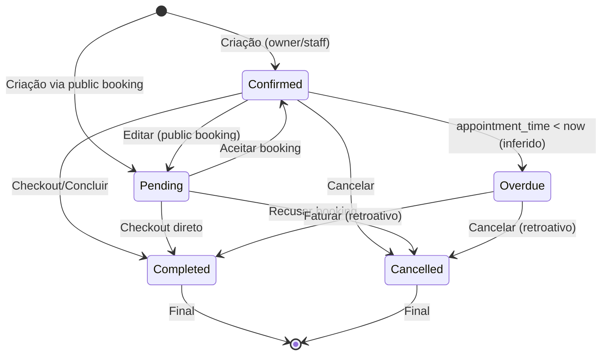
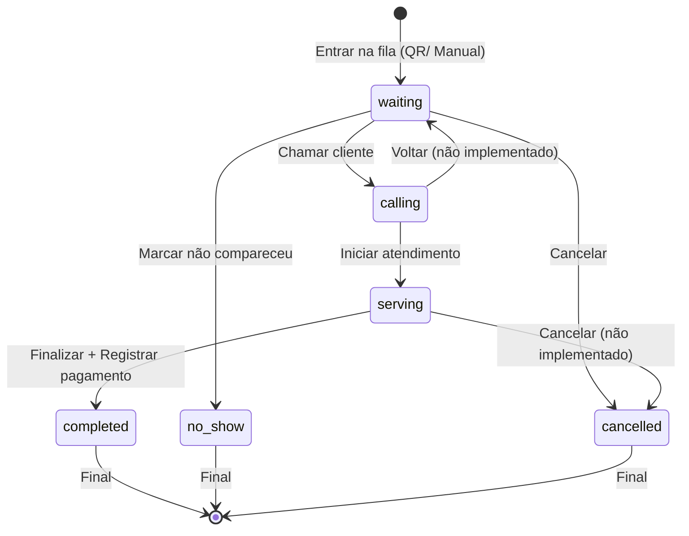
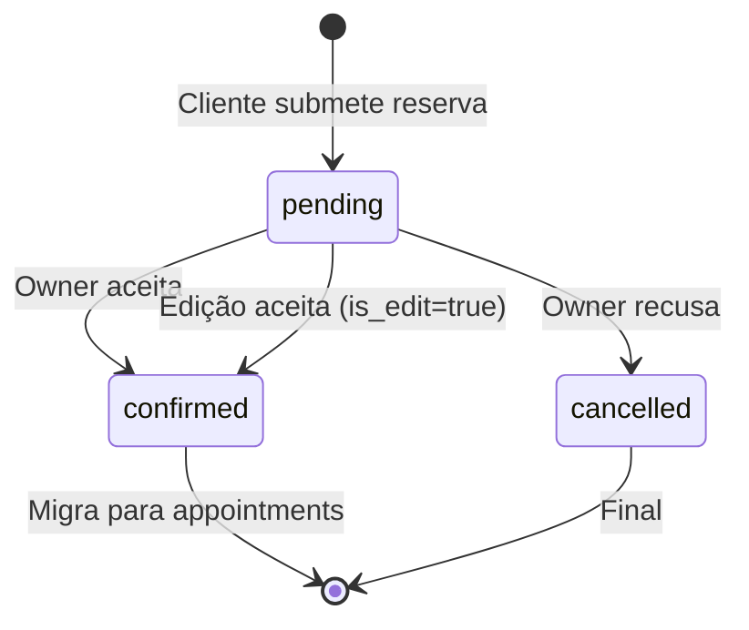
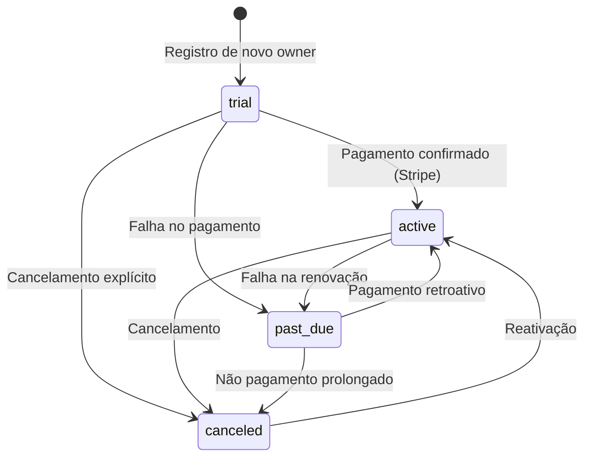
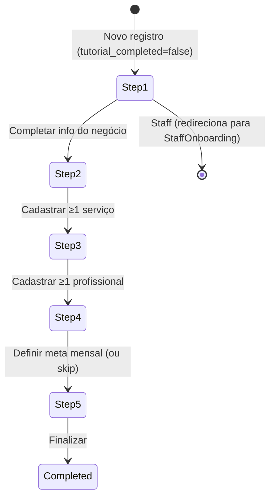
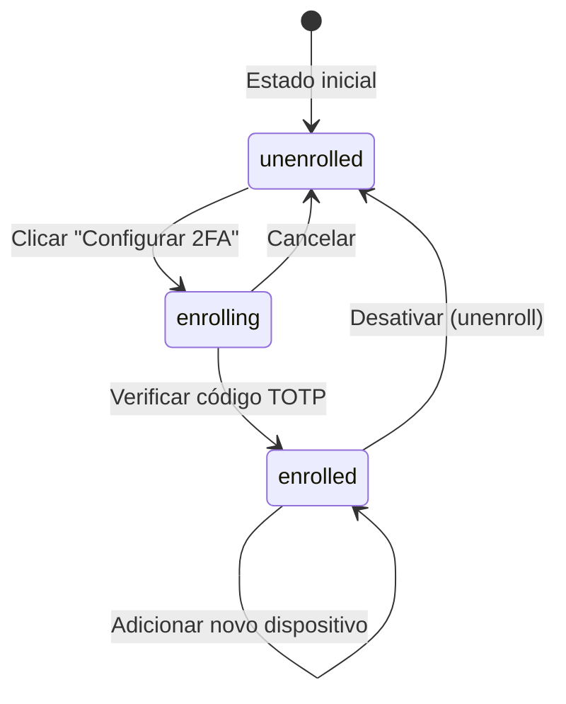
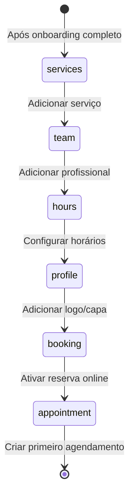

# Máquinas de Estado — agendix

> Gerado pelo Detective em 2026-05-06
> Nível de confiança: 🟢 Confirmado | 🟡 Inferido | 🔴 Lacuna

---

## 1. Agendamento (Appointment)

| Transição | Gatilho | Ator | Efeito Colateral |
|-----------|---------|------|------------------|
| Criação → Confirmed | `handleCreateAppointment` | Owner/Staff | Cria registro em `appointments`, opcionalmente envia WhatsApp |
| Criação → Pending | `handleSubmit` (PublicBooking) | Cliente | Cria em `public_bookings`, notifica owner em real-time |
| Confirmed → Completed | `handleCompleteAppointment` / CheckoutModal | Owner/Staff | RPC `complete_appointment` cria `finance_records`, atualiza status |
| Confirmed → Cancelled | `handleCancelAppointment` | Owner/Staff | Atualiza status, sem efeito financeiro |
| Pending → Confirmed | `handleAcceptBooking` | Owner | Cria/atualiza `appointments`, atualiza `public_bookings.status='confirmed'`, opcionalmente envia WhatsApp |
| Pending → Cancelled | `handleRejectBooking` | Owner | Atualiza `public_bookings.status='cancelled'` |
| Overdue → Completed | `handleCompleteAppointment(apt.id, true)` | Owner/Staff | Mesmo fluxo de conclusão normal |

**Notas:**
- 🟡 Estado `Overdue` não é persistido no banco — é uma classificação em memória (`isOverdueFilter`)
- 🟢 Staff não pode cancelar agendamentos `Completed` (guard D-07)
- 🟢 Checkout de atendimento (Fase 3) adiciona campos: `payment_method`, `received_by`, `machine_fee_applied`, `machine_fee_percent`, `machine_fee_amount`

---

## 2. Fila Digital (QueueEntry)

| Transição | Gatilho | Ator | Efeito Colateral |
|-----------|---------|------|------------------|
| → waiting | `handleManualAdd` / QR Code scan | Cliente/Owner | Insert em `queue_entries` |
| waiting → calling | `updateStatus(id, 'calling')` | Owner | Som de notificação, filtro atualizado |
| waiting → no_show | `updateStatus(id, 'no_show')` | Owner | Remove da lista ativa |
| calling → serving | `updateStatus(id, 'serving')` | Owner | Atualiza métricas |
| serving → completed | `confirmFinish` | Owner | Cria cliente (se novo), cria `appointments` (Completed), cria `finance_records`, atualiza `queue_entries` |

**Notas:**
- 🟢 Fila é filtrada por dia (`joined_at >= hoje`)
- 🟢 Entradas `completed` permanecem visíveis no histórico do dia
- 🔴 Não há transição de `no_show` de volta para `waiting`

---

## 3. Reserva Pública (PublicBooking)

| Transição | Gatilho | Ator | Efeito Colateral |
|-----------|---------|------|------------------|
| → pending | `handleSubmit` (PublicBooking.tsx) | Cliente | Upload de foto opcional, insert em `public_bookings` |
| pending → confirmed | `handleAcceptBooking` | Owner | Cria/atualiza `appointments`, sincroniza foto do cliente |
| pending → cancelled | `handleRejectBooking` | Owner | Atualiza status |

**Notas:**
- 🟢 Edição de reserva (`is_edit`) busca agendamento original por `original_appointment_time`
- 🟢 Aceitar booking tenta encontrar cliente por telefone em 3 formatos (raw, BR, PT)

---

## 4. Assinatura (Subscription)

| Estado | Regra de Negócio |
|--------|------------------|
| trial | 7 dias após registro. `trial_ends_at = now + 7d`. |
| active | Pagamento confirmado via Stripe webhook. |
| past_due | Stripe reporta falha na cobrança recorrente. |
| canceled | Cancelamento explícito ou expiração sem pagamento. |
| subscriber | 🟡 Estado legado? Aparece no AuthContext mas não em `types.ts`. Herdado por staff. |

**Notas:**
- 🟢 `isSubscriptionActive` é computado: `active || subscriber || (trial && não expirado)`
- 🟢 Staff herda o status de assinatura do owner
- 🔴 Não há máquina de estado explícita para downgrade de plano (Solo ↔ Equipe)

---

## 5. Onboarding Wizard

| Step | Título | Pré-requisito | Persistência |
|------|--------|---------------|--------------|
| 1 | Bem-vindo | — | `business_settings.onboarding_step = 1` |
| 2 | Seus Serviços | — | `onboarding_step = 2` |
| 3 | Sua Equipe | — | `onboarding_step = 3` |
| 4 | Sua Meta | — | `onboarding_step = 4` |
| 5 | Tudo Pronto! | — | `onboarding_step = 5`, `onboarding_completed = true`, `tutorial_completed = true` |

**Notas:**
- 🟢 Step atual é persistido via RPC `update_onboarding_step`
- 🟢 Wizard legado (5 steps via `business_settings` columns) coexistia com wizard novo — verificar se ainda existe
- 🟡 SetupCopilot (guided mode) é ativado após wizard com 6 milestones

---

## 6. 2FA / MFA

| Estado | Descrição |
|--------|-----------|
| unenrolled | Nenhum fator TOTP verificado. |
| enrolling | QR Code gerado, aguardando verificação do primeiro código. |
| enrolled | Pelo menos 1 fator TOTP `status === 'verified'`. |

**Notas:**
- 🟢 Fluxo: `enroll()` → `challenge()` → `verify()`
- 🟢 Múltiplos dispositivos suportados
- 🟢 Desativação requer confirmação explícita do usuário

---

## 7. Configuração de Wizard Guiado (SetupCopilot)

| Milestone | Elemento Alvo | Path |
|-----------|---------------|------|
| services | `#btn-add-service` | `/configuracoes/servicos` |
| team | `#btn-add-team-member` | `/configuracoes/equipe` |
| hours | `#business-hours-section` | `/configuracoes/geral` |
| profile | `#profile-logo-upload` | `/configuracoes/geral` |
| booking | `#toggle-public-booking` | `/configuracoes/agendamento` |
| appointment | `#btn-new-appointment` | `/agenda` |

**Notas:**
- 🟢 Progresso rastreado em `sessionStorage`
- 🟢 Spotlight via `WizardPointer` (driver.js)
- 🟡 Não está claro se milestones são validados automaticamente ou apenas sugeridos

---

*Fim do documento de máquinas de estado.*
