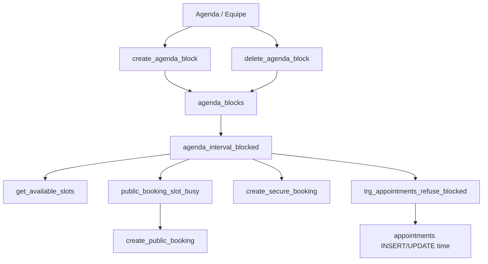

# Agenda — bloqueio por colaborador (design)

**Spec:** `specs/active/agenda-bloqueio-colaborador/spec.md`  
**Status:** draft  
**Data:** 2026-10-02

Sem código de aplicação neste corte — só o contrato para a implementação.

---

## Architecture Overview

Bloqueio é um intervalo pontual (`agenda_blocks`), não um status do appointment. A UI desenha a faixa; **a trava é o banco**.



Tenant: `user_id TEXT` = `get_auth_company_id()` (mesmo eixo de `appointments` / `business_settings`). `professional_id` = `team_members.id`. Nunca aceitar company_id de URL ou form.

---

## Data model

### `agenda_blocks`

```sql
CREATE TABLE public.agenda_blocks (
  id              uuid PRIMARY KEY DEFAULT gen_random_uuid(),
  user_id         text NOT NULL,              -- tenant (dono / company_id da sessão)
  professional_id uuid NOT NULL REFERENCES public.team_members(id) ON DELETE CASCADE,
  starts_at       timestamptz NOT NULL,
  ends_at         timestamptz NOT NULL,
  created_by      uuid,                       -- auth.uid() de quem criou
  created_at      timestamptz NOT NULL DEFAULT now(),
  CONSTRAINT agenda_blocks_interval_chk CHECK (ends_at > starts_at)
);

-- Sobreposição do mesmo profissional (fim exclusivo)
-- Requer btree_gist (já comum no Supabase). Se indisponível: unique via RPC.
EXCLUDE USING gist (
  professional_id WITH =,
  tstzrange(starts_at, ends_at, '[)') WITH &&
)
```

Sem coluna de motivo, status ou aprovação. Dia inteiro / multi-dia = `starts_at`/`ends_at` no fuso do negócio (`business_timezone`), persistidos em timestamptz. Convenção: intervalo **meio-aberto** `[starts_at, ends_at)`.

Índice: `(user_id, professional_id, starts_at)`.

RLS: SELECT autenticado com `user_id = get_auth_company_id()` (staff vê a grade). INSERT/UPDATE/DELETE direto **revogados** para `authenticated`/`anon` — só via RPC.

### `business_settings.staff_can_block_agenda`

```sql
ALTER TABLE public.business_settings
  ADD COLUMN IF NOT EXISTS staff_can_block_agenda boolean NOT NULL DEFAULT true;
```

Só o dono altera (mesmo padrão de `staff_appointment_edit_scope`). Default true = comportamento novo já liberado para a equipe na própria coluna. Desligar **não** apaga linhas em `agenda_blocks`.

---

## RPCs e helper

Todas `SECURITY DEFINER`, `search_path = public`, tenant da sessão. `REVOKE ALL FROM PUBLIC/anon`. `GRANT EXECUTE TO authenticated`.

### `agenda_interval_blocked(p_user_id text, p_professional_id uuid, p_starts_at timestamptz, p_ends_at timestamptz) → boolean`

`EXISTS` em `agenda_blocks` do tenant+profissional com `starts_at < p_ends_at AND ends_at > p_starts_at`. STABLE. Uso interno (também `service_role`).

Sobreposição de um appointment: `p_starts_at = appointment_time`, `p_ends_at = appointment_time + duration`.

### `create_agenda_block(p_professional_id uuid, p_starts_at timestamptz, p_ends_at timestamptz, p_acknowledge_conflicts boolean DEFAULT false) → json`

1. Recusa intervalo inválido / profissional de outro tenant / inativo.
2. Authz: owner → qualquer membro; staff → só se flag true **e** `team_members.id` do caller = `p_professional_id`.
3. Lista conflitos: `appointments` status `Confirmed`|`Pending` **ou** `public_bookings` `pending` (e `confirmed` ainda ocupando slot, mesma regra de `confirmed_booking_slot_released`).
4. Se há conflitos e `p_acknowledge_conflicts = false` → `{ success: false, code: 'conflicts', items: [...] }` — **não grava**.
5. Se ack ou lista vazia → INSERT. **Não** cancela, updatea ou notifica os itens.
6. Resposta ok: `{ success: true, id: <uuid> }`.

### `delete_agenda_block(p_block_id uuid) → json`

Mesma authz (staff só o próprio `professional_id`). DELETE físico. Idempotente se já não existe no tenant.

Opcional: `list_agenda_block_conflicts(...)` se a UI quiser pré-listar antes do submit; senão o create já devolve `conflicts`.

---

## Enforcement (obrigatório)

Patch das funções atuais (última fonte: `20260925160000_noshow_frees_slot.sql` + `create_public_booking` em `20260918190000`):

| Superfície | Mudança |
|------------|---------|
| `get_available_slots` | No loop de slot, `v_is_busy` também se `agenda_interval_blocked(...)`. Vale para cliente **e** `p_is_professional` — **sem encaixe**. |
| `public_booking_slot_busy` | `UNION ALL` o helper (ou `OR agenda_interval_blocked`). |
| `create_public_booking` | Continua chamando `public_booking_slot_busy` → herda a recusa (`slot_unavailable`). |
| `create_secure_booking` | Checar o helper **antes** do insert; mesma mensagem de horário ocupado (ou código estável `agenda_blocked`). Dono incluso. |
| INSERT `appointments` (wizard / `createAgendaAppointment`) | Trigger abaixo. |

### Trigger em `appointments`

`BEFORE INSERT OR UPDATE OF appointment_time, professional_id, duration_minutes`.

- Ignora `Cancelled` / `NoShow` (e UPDATE só de status).
- Se `NEW.professional_id` IS NULL, não aplica (coluna órfã).
- Se `agenda_interval_blocked(NEW.user_id, NEW.professional_id, NEW.appointment_time, NEW.appointment_time + duration)` → `RAISE` (`check_violation` / `42501`, código `agenda_blocked`).
- Roda para `authenticated` **e** para SECURITY DEFINER que insere na tabela (não filtrar `current_user`), senão a RPC furaria a trava. RPCs de checkout/fila que **não** mudam horário não disparam o `OF`.

Defesa extra (recomendado): trigger equivalente em `public_bookings` INSERT/UPDATE de tempo, caso alguma policy ainda permita insert direto.

`get_full_dates` já delega a `get_available_slots` — herda.

---

## Authz (resumo)

| Caller | Flag | Create/Delete | Vê faixa |
|--------|------|---------------|----------|
| Owner | qualquer | qualquer profissional do tenant | sim + Desbloquear |
| Staff | true | só `teamMemberId` | sim + Desbloquear na própria |
| Staff | false | recusa | sim, copy **Agenda bloqueada**, sem Desbloquear |
| Anon | — | recusa | n/a (público só omite slot) |

Toggle off não invalida linhas. Staff nunca desbloqueia coluna alheia.

---

## UI

### Grade

- `AgendaResourceGrid` recebe `blocks[]` do dia visível (fetch por janela `buildAgendaDayWindow`).
- Faixa absoluta na coluna, `data-testid="agenda-block-band"`, classe **`agenda-block-band`**.
- CSS (distinto de off-hours):

```css
.agenda-slot-off-hours { /* já existe: 135deg, 1px / 7px, muted 9% */ }
.agenda-block-band {
  background-image: repeating-linear-gradient(
    45deg,
    color-mix(in srgb, var(--color-text-muted) 22%, transparent) 0 2px,
    transparent 2px 6px
  );
}
```

Rótulo **Bloqueado** (`text-xs`). Clique → sheet/resumo.

### Pontos de entrada

1. **+ da Agenda** (`pages/Agenda.tsx` header; no mobile o CTA de novo da página — hoje o `+` do header é `hidden md:contents`; não abrir o wizard direto): action sheet **Novo atendimento** / **Bloquear agenda**.
2. Slot vazio (`AgendaEmptySlotCell`): se pode bloquear aquela coluna, segundo ação **Bloquear a partir daqui** com hora pré-preenchida (owner = qualquer coluna; staff = só a própria e flag on).
3. Equipe: card **Bloqueios** (próximos + criar) + toggle na `StaffAppointmentPermissionSection` (`SettingsRow` + `SettingsSwitch`).

Formulário: profissional (fixo ou picker), início, fim; atalho dia inteiro; **sem** textarea de motivo. Conflitos: lista + confirmar (`p_acknowledge_conflicts`).

Erro de RPC/trigger na Agenda/wizard/edit modal: toast claro (“Agenda bloqueada neste horário”), sem caminho de override.

Booking público (`services/publicBooking.ts` + `pages/PublicBooking.tsx`): nenhuma faixa — lista já vem furada.

---

## Files to change

| Arquivo | Papel |
|---------|--------|
| `supabase/migrations/20261002HHMMSS_agenda_blocks.sql` | tabela, coluna, helper, RPCs, trigger, patch slots/booking |
| `supabase/tests/agenda_blocks.test.sql` | recusa dono/staff/anon, flag, conflitos não cancelam |
| `types/settings.ts` | `staff_can_block_agenda` opcional (front antigo / coluna ausente) |
| `services/settings.ts` + `hooks/useSettings.ts` | update da flag (só owner) |
| `services/agendaBlocks.ts` + `hooks/useAgendaBlocks.ts` | list/create/delete via RPC |
| `pages/Agenda.tsx` | fetch, CTA +, sheet, resumo Desbloquear |
| `components/agenda/AgendaResourceGrid.tsx` | overlay da faixa |
| `components/agenda/AgendaEmptySlotCell.tsx` | Bloquear a partir daqui |
| `components/agenda/AgendaBlockForm.tsx` (novo) | início/fim, picker, conflitos |
| `components/settings/StaffAppointmentPermissionSection.tsx` | toggle |
| `pages/settings/TeamSettings.tsx` | seção Bloqueios |
| `styles/tailwind.css` | `.agenda-block-band` |
| `components/AppointmentEditModal.tsx` | mapear erro `agenda_blocked` |
| `components/AppointmentWizard.tsx` | idem no create |
| `test/components/AgendaResourceGrid*.test.tsx` | faixa ≠ off-hours; staff sem Desbloquear |

Fora: `create_public_booking` UI, fila, CRM, motivo, recorrência.

---

## Tech decisions

| Decisão | Escolha | Por quê |
|---------|---------|---------|
| Trava | Banco (helper + trigger + RPCs) | UI sozinha o dono/staff furam |
| Mutação | Só RPC | Permissão staff≠owner não cabe em RLS simples |
| Encaixe | Não existe | Spec: hard lock |
| Conflito | Lista + ack; zero cancel | Produto |
| Intervalo | `[start, end)` timestamptz | Dia inteiro e multi-dia sem ambiguidade de fuso |
| Visual | Classe nova, ângulo oposto ao off-hours | Não misturar “fechado” com “bloqueado” |
| Flag default | `true` | Equipe já opera a própria agenda no dia a dia |

---

## Testes

- SQL: helper overlap; create recusa staff alheio; create dono ok; flag off recusa staff; `create_secure_booking` dono falha no intervalo; `public_booking_slot_busy` true; `get_available_slots` omite; UPDATE horário falha; ack cria e o Confirmed permanece.
- Vitest: banda `agenda-block-band`; empty slot staff coluna própria vs alheia; flag off esconde ações.
- E2E: fluxo da spec (mobile 390 + desktop).
