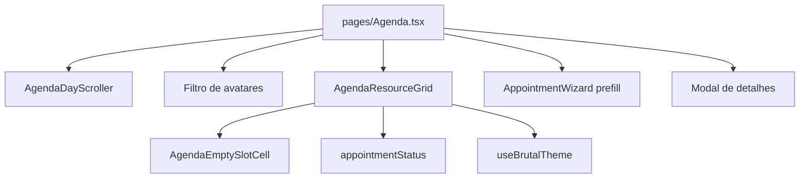

# Agenda colunas — Design

**Spec**: `specs/active/agenda-colunas-espacamento/spec.md`
**Status**: Approved (CTO)

---

## Architecture Overview

A página `pages/Agenda.tsx` deixa de ramificar `md:hidden` lista vs `hidden md:block` grade. O corpo do dia passa a ser um componente único `AgendaResourceGrid`, alimentado pelos dados já calculados (`timeSlots`, `displayedMembers`, `appointments`, `showUnassigned`).



---

## Code Reuse Analysis

### Existing Components to Leverage

| Component | Location | How to Use |
|-----------|----------|------------|
| AgendaDayScroller | `components/agenda/AgendaDayScroller.tsx` | Compactar chips; manter drag/snap de dias |
| AgendaEmptySlotCell | `components/agenda/AgendaEmptySlotCell.tsx` | Célula vazia; ajustar `min-h` via className |
| getVisualStatus / VISUAL_STATUS_* | `utils/appointmentStatus.ts` | Cards da grade |
| formatCurrency | `utils/formatters.ts` | Preço no card |
| buildAgendaGridSlots | `utils/agendaTimeSlots.ts` | Sem mudança |
| useBrutalTheme | `hooks/useBrutalTheme.ts` | colors, accent, font — sem hex |

### Integration Points

| System | Integration Method |
|--------|--------------------|
| Wizard | `onEmptySlotClick(professionalId, time)` → `openNewAppointmentAt` |
| Detalhes | `onSelectAppointment(apt)` → `setShowingDetailsAppointment` |
| Filtro | `displayedMembers` / `selectedProfessionalIds` inalterados |

---

## Components

### AgendaResourceGrid

- **Purpose**: Grade horário × colaborador, mobile e desktop.
- **Location**: `components/agenda/AgendaResourceGrid.tsx`
- **Interfaces**:

```ts
export interface AgendaGridAppointment {
  id: string;
  clientName: string;
  service: string;
  appointment_time: string;
  price: number;
  status: string;
  professional_id: string | null;
  duration_minutes?: number;
  edited_at?: string | null;
  notes?: string;
}

export interface AgendaGridMember {
  id: string;
  name: string;
  photo_url?: string;
}

export interface AgendaResourceGridProps {
  members: AgendaGridMember[];
  appointments: AgendaGridAppointment[];
  timeSlots: string[];
  showUnassigned: boolean;
  currencyRegion: 'BR' | 'PT';
  onSelectAppointment: (apt: AgendaGridAppointment) => void;
  onEmptySlotClick: (professionalId: string, time: string) => void;
}
```

- **Layout**:
  - `data-testid="agenda-resource-grid"`
  - Outer: `overflow-x-auto snap-x snap-mandatory touch-pan-x scrollbar-hide`
  - Inner: `inline-flex min-w-full`
  - Time gutter: `sticky left-0 z-20 w-12 md:w-16` + `bg` do tema
  - Coluna: `snap-start shrink-0 min-w-[152px] md:min-w-[176px] md:flex-1` + `data-testid={agenda-col-${id}}`
  - Header row: `sticky top-0 z-10` (célula canto `z-30`)
  - Rows: `h-12 md:h-14`
- **Dependencies**: EmptySlotCell, appointmentStatus, formatCurrency, lucide (Edit2, MessageCircle, status icons), useBrutalTheme
- **Reuses**: Markup/lógica da grade desktop atual em Agenda.tsx (~1477–1576)

### AgendaDayScroller (modificar)

- Chips: `w-11 h-14` (44×56); `text-lg` no número; `mb-1` no mês.
- Manter `data-testid`, drag, range, a11y.

### Staff filter (Agenda.tsx)

- Avatares `w-11 h-11`, `gap-3`, `min-w-[56px]`, `pb-1`.
- `title={member.name}`; truncate com primeiro nome.
- Remover span do dot verde.
- Manter `data-testid="agenda-filter-all"`.

### Agenda.tsx (wire)

- `space-y-3 md:space-y-4`
- Remover bloco mobile lista + EmptyState do dia.
- Remover grade desktop duplicada.
- Render `<AgendaResourceGrid ... />` no lugar.
- Hint vazio: texto no grid, não Card+EmptyState.

---

## Error Handling Strategy

| Error Scenario | Handling | User Impact |
|----------------|----------|-------------|
| Sem membros | Empty state de perfil (já existe) | Inalterado |
| Sem agendamentos | Grade vazia + hint `text-xs` | Slots clicáveis |
| Muitos profissionais | Scroll X + snap | Peek da próxima coluna |

---

## Tech Decisions

| Decision | Choice | Rationale |
|----------|--------|-----------|
| Um componente vs media-query dual | Um grid | Evita drift mobile/desktop |
| Sticky CSS vs JS | `position: sticky` | Sem lib, performático |
| Snap | CSS `snap-x` / `snap-start` | Padrão já usado no day scroller |
| Extração | Novo ficheiro | Agenda.tsx já ~2000 linhas |
| Dots “online” | Remover | Não há presença real; ruído visual |

---

## Visual / UX (design system)

- Containers: `rounded-2xl`, `border` via `colors.border`, fundo `colors.surface` / `colors.card`.
- Mobile cards: `shadow-lite-glass` só no agendamento (não `shadow-sm`).
- Texto mínimo `text-xs`. Toque ≥44px nos chips/avatares; células da grade podem ter 48px de altura (compromisso de densidade da spec v2) — empty slot continua botão de largura total da célula.
- Foco: `focus-visible:ring-2 ring-theme-accent`.
- Contraste: cores de status já tokenizadas.
