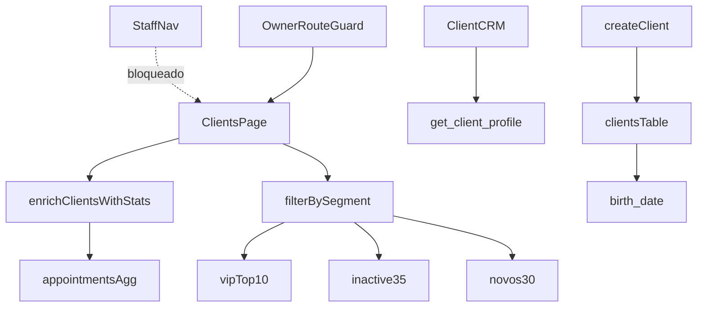

# Clientes / CRM v2 — Design

**Spec**: `specs/active/clientes-crm-v2/spec.md`  
**Context**: `specs/active/clientes-crm-v2/context.md`  
**Status**: Approved (implementação)

---

## Architecture Overview

## Reuse

- `services/crm.ts` — estender (não duplicar fetch na página)
- `get_client_profile` RPC — manter no detalhe
- `components/ui` Card/Button/Modal/EmptyState/Input
- `formatRelativeDate` / novo helper de “há N dias”
- `OwnerRouteGuard` existente
- `ClientSelection` na Agenda (já cria cliente; corrigir `companyId`)

## Data

- `clients.birth_date DATE NULL` (migration)
- Agregação lista (client-side v1): visits, last_visit_at, first_visit_at, ltv por `appointments` Completed

## UI (Operate + Distill)

- Lista: row/card denso, chips de status, sem gasto, aniversário discreto
- CRM: cabeçalho + 3 KPIs + histórico lista + nota — sem IA/rating/membro-desde
- Modal create: nome, tel, e-mail, aniversário, foto — sem Origem
