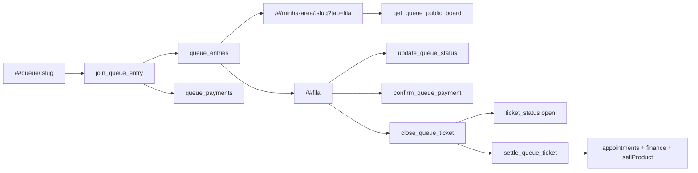

# Fila Digital v2 — Design

**Spec:** `specs/active/fila-digital-v2/spec.md`  
**Context:** `specs/active/fila-digital-v2/context.md`  
**Status:** Ready for review (eval Opus + validator GPT aplicados)  
**Data:** 2026-09-06

---

## Architecture Overview

Estender o domínio atual (`queue_entries` + RPCs com prova de telefone + `finish_queue_entry`). Não criar um segundo produto paralelo.

Três superfícies, um núcleo:



Princípios:

1. **Tenant:** `queue_entries.business_id` continua sendo o UUID do dono (`profiles.id`). Mutations autenticadas usam `companyId` / `get_auth_company_id()` — **nunca** `user.id` do staff.
2. **Público:** zero SELECT direto na tabela. Tudo via RPC + prova de telefone (já é o padrão S2).
3. **Pagamento de serviço ≠ Pix do clube.** Nova tabela `queue_payments`. Reusar UI (`PixDisplay`, `MbwayDisplay`) e geradores (`lib/pix-generator.ts`).
4. **Comanda** é o próprio `queue_entry` depois que sai de `serving`, com `ticket_status`. Sem tabela extra no MVP.
5. **Join** só via RPC. **DROP** da policy `"Public can join queue"` (`INSERT WITH CHECK (true)`). Staff/status/settle também só via RPC — a policy de UPDATE ampla do staff vira SELECT-only.
6. **Check-in** é token no QR validado no servidor. Senha ativa no servidor **destrava** a aba mesmo sem o token (recovery).

---

## Code Reuse Analysis

| Peça | Location | Uso |
|------|----------|-----|
| Catálogo público | `services/publicBooking.ts` | Serviços, categorias, profissionais no QR |
| Sessão telefone | `PublicClientContext` | Login/register; pular cadastro se já logado |
| Gate Minha Área | `ClientArea.handlePhoneCheck` | Recuperar senha (FILA-09) |
| Membership pública | `fetchPublicClientMembership` | Oferecer “Usar assinatura” + teto de uso |
| Algoritmo de clube | extrair núcleo puro de `useSubscriptionDiscount` | Trabalho novo (hoje o hook depende de `useAuth`). Elegibilidade + consumo **atômicos no banco** no join/settle |
| Pix/MB WAY UI | `PixDisplay`, `MbwayDisplay`, `lib/pix-generator`, `lib/club-payment` | Pagamento na entrada |
| Confirmação recebedor | padrão `PixActions` / `confirmMembershipPayment` | Novo RPC `confirm_queue_payment` |
| Checkout | `CheckoutModal` (blocos, não o modal inteiro) | `QueueCheckoutSheet`: métodos, produtos, receivedBy, taxa |
| Produtos | `sellProduct` | Só no settle da comanda |
| Dedup telefone | `find_active_queue_entry_by_phone`, UNIQUE parcial | Manter |
| Finish atômico | `finish_queue_entry` | **Delega** para `settle_queue_ticket` (mesmos invariantes). Não ficar dois fechamentos vivos |
| QR | gerar local (`qrcode` já no clube) | **Não** `api.qrserver.com` |
| Staff RLS | `20260724` | SELECT ok; UPDATE/INSERT diretos saem; mutations = RPC |

**Não copiar:** `create_public_pix_payment` (FK membership), `calcEstimatedWaitMinutes` (20 min), `ClientAuthModal` (e-mail), datetime do booking, Pix via serviço externo.

**Corrigir no mesmo ciclo:** `QueueManagement` passa `businessId: user.id` — staff quebra. Trocar para `companyId`.

---

## Data Models

### Settings (dono) — `business_settings`

```sql
queue_mode            TEXT NOT NULL DEFAULT 'shared'
                      CHECK (queue_mode IN ('shared', 'per_professional'));
queue_allow_leave     BOOLEAN NOT NULL DEFAULT true;
queue_late_minutes    INTEGER NOT NULL DEFAULT 10
                      CHECK (queue_late_minutes BETWEEN 1 AND 120);
```

Troca de `queue_mode` só via RPC `set_queue_mode`. Join e set_mode compartilham **lock do tenant** (`SELECT … FROM business_settings WHERE user_id = … FOR UPDATE` ou advisory lock). Sem isso há corrida “fila vazia → join no mesmo instante”.

### `queue_entries` — colunas novas

```sql
client_id              UUID REFERENCES clients(id) ON DELETE SET NULL;
duration_minutes       INTEGER NOT NULL;          -- snapshot
service_price_cents    INTEGER NOT NULL;          -- snapshot (Pix e settle)
extra_service_lines    JSONB NOT NULL DEFAULT '[]';
-- serviços acrescentados na comanda: [{ service_id, name, price_cents, duration_minutes }]
payment_method         TEXT;
payment_status         TEXT NOT NULL DEFAULT 'unpaid'
                       CHECK (payment_status IN
                         ('unpaid','awaiting_confirmation','paid','membership'));
ticket_status          TEXT NOT NULL DEFAULT 'none'
                       CHECK (ticket_status IN ('none','open','settled'));
closed_at              TIMESTAMPTZ;
closed_by              UUID;
serving_at             TIMESTAMPTZ;
settled_appointment_id UUID UNIQUE;
product_lines          JSONB NOT NULL DEFAULT '[]';
```

Constraints: `service_id`, `professional_id`, `client_id` e itens JSON **pertencem ao tenant** (validação na RPC; FK/trigger onde der). Índice parcial ativo `(business_id, professional_id, joined_at)` em `waiting|calling|serving`.

`ticket_status`:

- `none` — ainda na operação (`waiting`/`calling`/`serving`)
- `open` — comanda fechada, pagamento/itens a lançar (lista Comandas)
- `settled` — financeiro + appointment gravados

### `queue_payments` — Pix/MB WAY do serviço

```sql
id              UUID PK
business_id     UUID NOT NULL
queue_entry_id  UUID NOT NULL REFERENCES queue_entries(id) ON DELETE CASCADE
method          TEXT NOT NULL CHECK (method IN ('pix','mbway'))
amount_cents    INTEGER NOT NULL          -- = service_price_cents na criação
br_code         TEXT
txid            TEXT
mbway_phone     TEXT                      -- PT
expires_at      TIMESTAMPTZ
status          TEXT NOT NULL DEFAULT 'pending'
                CHECK (status IN ('pending','paid','expired','cancelled'))
confirmed_by    UUID
confirmed_at    TIMESTAMPTZ
created_at      TIMESTAMPTZ DEFAULT now()
```

Índices: FK `queue_entry_id`; `(business_id, status)`; unique parcial um pending/paid por entry. `business_id` da payment = da entry (CHECK/trigger). Staff pode **cancelar** pending e converter para balcão.

**Não** reusar `pix_payments` (FK `membership_id`).

### Tipos (estender `types/queue.ts`)

```typescript
type QueueMode = 'shared' | 'per_professional';
type QueuePaymentStatus = 'unpaid' | 'awaiting_confirmation' | 'paid' | 'membership';
type QueueTicketStatus = 'none' | 'open' | 'settled';

interface QueueSettings {
  queueMode: QueueMode;
  allowLeave: boolean;
  lateMinutes: number;
}

interface QueuePublicBoardPerson {
  position: number;
  firstName: string;
  isYou: boolean;
}

interface QueuePublicBoard {
  entryId: string;
  status: QueueStatus;
  paymentStatus: QueuePaymentStatus;
  serviceName: string;
  position: number | null;
  etaMinutes: number | null; // null = indisponível (ex.: zero staff)
  people: QueuePublicBoardPerson[];
  settings: Pick<QueueSettings, 'allowLeave' | 'lateMinutes'>;
  calledAt: string | null;
}
// Sem client_phone. Nunca SETOF queue_entries.
```

---

## RPCs (contratos)

Todas SECURITY DEFINER, `SET search_path = public`, `REVOKE ALL FROM PUBLIC`, grant explícito. Tenant resolvido no servidor (slug → `profiles.id`; auth → `get_auth_company_id()`). Payload do cliente **não** manda `business_id` solto. Mutations: `SELECT … FOR UPDATE` na entry e validam estado esperado.

| RPC | Quem | Função |
|-----|------|--------|
| `join_queue_entry` | anon/auth | Lock settings → valida token QR + slug + serviço/pro do tenant → unique phone (tratar `unique_violation`) → snapshot duration/price → insert → pix/mbway cria payment. Se `queue_mode=shared` e **zero** staff ativo: recusa join. |
| `get_queue_public_board` | anon/auth | Prova telefone **normalizada** + tenant. DTO sem phone. |
| `find_active_queue_entry_by_phone` | já existe | Recuperar senha — **destrava aba** sem token QR |
| `cancel_queue_entry_public` | já existe | Sair da fila (UI no `ClientQueuePanel`) |
| `add_manual_queue_entry` | authenticated | Nome + tel + serviço obrigatório; `pro` se `per_professional`; pagamento checkout; pix/mbway cria payment; clube se couber |
| `update_queue_status` | authenticated | `waiting→calling`, `waiting→serving`, `calling→serving`, `calling→waiting` (devolver), `→no_show`. No `→serving` (modo shared): seta `professional_id` do `team_members` do usuário logado. `per_professional`: no máximo um `serving` por pro. |
| `confirm_queue_payment` | authenticated | pending → paid |
| `cancel_queue_payment` | authenticated | pending → cancelled; entry pode virar `unpaid` (balcão) |
| `set_queue_mode` | owner | Mesmo lock do join; aborta se fila ativa |
| `update_queue_settings` | owner | leave + late minutes |
| `close_queue_ticket` | authenticated | `serving` → `completed` + `ticket_status=open` |
| `settle_queue_ticket` | authenticated | Appointment + finance + sellProduct; revalida teto do clube; `settled_appointment_id`; se paid/membership não cobra de novo |

`finish_queue_entry` (legado) **chama** `settle_queue_ticket` com o preço/serviço atuais da entry. Um só invariante.

**ETA:** simular cadeiras, não média. Ordenar `joined_at, id`. Cada cadeira = 1 `serving` + fila. Tempo restante de quem está `serving` = `GREATEST(duration - elapsed, 0)`. `per_professional` = 1 cadeira daquele pro. Zero staff ativo → ETA `null` e join shared bloqueado. Entry no modo shared **permanece na fila compartilhada** mesmo depois de ganhar `professional_id` no atender.

---

## Components

### Cliente — `pages/QueueJoin.tsx` (reescrever o fluxo, reusar catálogo)

- **Purpose:** wizard QR: serviço → identidade → pagamento → redirect Minha Área.
- **Location:** `pages/QueueJoin.tsx` + `components/queue/QueueServiceStep.tsx`, `QueuePayStep.tsx`
- **Reuses:** `fetchPublicServices/Categories`, `PublicClientContext`, `PhoneInput`, `PixDisplay`/`MbwayDisplay`, `useBrutalTheme({ override })` + `data-theme`/`data-mode` como ClientArea
- **Interfaces:**
  - `onServicePicked(serviceId)`
  - `onIdentityReady(client: PublicClient)`
  - `onPayChosen(method)` → `join_queue_entry`
- **QR:** token assinado curto no hash (`/#/queue/:slug?t=…&pro=`). RPC valida. QR impresso antigo sem token: ainda aceita **neste MVP** se o slug existir (casa walk-in); aba Minha Área sem senha ativa e sem token = bloqueada.
- **QR `?pro=`:** chip “Fila de {primeiro nome}”; cliente **não** troca profissional. Pro inativo → recusa + “Peça o QR da casa.”
- **Pagamento:** três cards explícitos quando assinante elegível — **Usar assinatura** / **Pagar no balcão** / **Pagar agora**. Sem clube ou teto estourado: só balcão + agora.

### Cliente — aba Fila em `ClientArea.tsx`

- **Purpose:** status vivo + política + primeiros nomes. **Senha ativa destrava** (recovery). Sem senha e sem token QR = bloqueada.
- **Location:** `components/queue/ClientQueuePanel.tsx`
- **Reuses:** gate telefone; `find_active_queue_entry_by_phone`; `get_queue_public_board`
- **Realtime:** **não** `postgres_changes` anon. Poll da RPC: 10s em `waiting`, **≤5s** em `calling`/`serving`. Broadcast autenticado fica P3.
- **Ações:** Sair da fila → `ConfirmModal` → `cancel_queue_entry_public`
- **Deprecar** `/#/queue-status/:id` → `/#/minha-area/:slug?tab=fila`

### Staff — `pages/QueueManagement.tsx`

- **Purpose:** operação mobile-first + Comandas + QR/ajustes (dono).
- **Location:** página + `QueueStaffCard`, `QueueCheckoutSheet`, `QueueSettingsSheet`, `QueueQrSheet`, `QueueManualAddSheet`, `QueueComandasList`
- **Layout mobile:** **uma coluna**. Primário = **Iniciar atendimento**; secundário = **Chamar cliente**; no card Pix: **Confirmar pagamento**.
- **Modo per_professional:** staff vê a **própria** fila em destaque; dono vê todas agrupadas.
- **Dono:** engrenagem → modo + política + QRs (geral **ou** um por pro ativo, download/print local). Toggle modo disabled com fila ativa. Sem slug → CTA criar slug (padrão Agenda).
- **Staff:** sem settings. `QueueManualAddSheet` sempre. Comandas: editar itens + settle.

### `QueueCheckoutSheet`

- **Purpose:** fechar comanda: finalizar já (editar itens) **ou** só salvar em Comandas.
- **Reuses:** grid de pagamento e produtos do `CheckoutModal`; `receivedBy` = usuário logado pré-selecionado (staff ou dono).
- **Se** `payment_status` é `paid` ou `membership`: banner “Pagamento já registrado. Confira e finalize.” — sem nova cobrança.

---

## UX (impeccable)

Regras:

- Tokens only (`useBrutalTheme`). Sem `isBeauty ? hex : hex`. Sem `shadow-xl` / blobs.
- Alvos ≥ 44px. Staff: ação primária com **label**.
- `PageHeader`, `EmptyState` bordered, `ConfirmModal`, `Modal`/`ui` — sem `fixed inset-0` caseiro.
- Público: `data-theme` + `data-mode` como ClientArea (barber dark / beauty light).
- Nunca expor UUID ao cliente.

### Copy travada (context)

| Superfície | Texto |
|------------|--------|
| Cliente Pix | **Aguarde a confirmação do pagamento.** Sua posição já está na fila. |
| Card staff Pix | **Aguardando confirmação e pagamento** |
| Pode sair | Após ser chamado, você tem **{N} minutos** para chegar à cadeira. |
| Não pode sair | Permaneça na casa enquanto aguarda. |
| Aba bloqueada | Fila disponível na casa. Escaneie o QR no balcão ou na bancada. |
| Chamar | **Chamar cliente** |
| Atender | **Iniciar atendimento** |
| Fechar | **Fechar comanda** |

Estados do card staff: `unpaid` / `awaiting_confirmation` / `paid` / `membership` visíveis **antes** de atender.

Timer de atraso: só depois de **Chamar cliente**. Cliente vê o prazo; staff vê countdown. Sem no-show automático.

---

## Error Handling

| Cenário | Handling | Usuário |
|---------|----------|---------|
| Telefone já na fila | RPC unique / dedup | “Este telefone já está na fila.” + recuperar senha |
| Sem check-in no join | RPC recusa | Aba bloqueada / QR de novo |
| Troca de modo com fila | RPC recusa | Toggle disabled + “Esvazie a fila para trocar o modo.” |
| Pix pendente no settle | Permite fechar; card continua aguardando | Staff só confere |
| Teto do clube | Não oferece “Usar assinatura” | Balcão / Pix |
| QR de pro inativo | Join recusa | “Este QR não está ativo. Peça o QR da casa.” |
| Staff sem companyId | Guard na mutation | Toast; nunca `user.id` |
| Sessão pública some | Gate telefone | Recupera se entry ativa |
| RLS vazio | Já conhecido | Queries autenticadas sempre com tenant certo |

---

## Security & RLS

- Público: **sem** SELECT/UPDATE direto. Board só RPC (firstName).
- `DROP POLICY "Public can join queue"`.
- Staff: policy UPDATE direta **removida** (ou SELECT-only). Status, pay, close, settle = RPC + `FOR UPDATE`.
- Dropar policy morta `"Queue: company isolation"` (`user_id` inexistente).
- Settings: owner-only.
- `queue_payments`: RLS tenant; `confirmed_by = auth.uid()`. Sem webhook neste MVP.
- Board/join: serviço, pro, cliente e produtos validados no **mesmo** `business_id`.

---

## Tech Decisions

| Decisão | Escolha | Por quê |
|---------|---------|---------|
| Comanda | Colunas em `queue_entries` | Menos joins; lista Comandas = `ticket_status=open` |
| Pix serviço | `queue_payments` nova | `pix_payments` é do clube |
| Join | RPC + DROP insert público | Fecha `WITH CHECK (true)` |
| ETA | Simulação de cadeiras, não média | Eval: média mente com cadeira ocupada |
| Cadeiras shared | Staff ativos; 0 = bloqueia join | Não inventar 1 cadeira fictícia |
| Checkout | Sheet novo | Entry ≠ appointment até o settle |
| Destino pós-join | Minha Área `?tab=fila` | Spec |
| Recovery | Telefone > token QR | Context §9 |
| `/queue-status/:id` | Redirect | QR antigos de status |
| Atraso | Informativo | Staff marca no-show / devolve |
| `finish_queue_entry` | Wrapper de `settle_queue_ticket` | Um invariante |
| QR image | Lib local | Sem `qrserver` |

---

## File map (implementação)

```
types/queue.ts                         estender
services/queue.ts                      + join RPC, board, settle, settings
services/queueEta.ts                   calc client-side só para testes da fórmula
hooks/useQueue.ts                      + settings, comandas, confirm pay
hooks/useQueueBoard.ts                 cliente
pages/QueueJoin.tsx                    wizard
pages/QueueManagement.tsx              operação + comandas
pages/QueueStatus.tsx                  redirect
pages/ClientArea.tsx                   tab fila
components/queue/QueueServiceStep.tsx
components/queue/QueuePayStep.tsx
components/queue/ClientQueuePanel.tsx
components/queue/QueueStaffCard.tsx
components/queue/QueueCheckoutSheet.tsx
components/queue/QueueSettingsSheet.tsx
components/queue/QueueQrSheet.tsx
components/queue/QueueManualAddSheet.tsx
components/queue/QueueComandasList.tsx
supabase/migrations/YYYYMMDD_queue_v2.sql
test/services/queue.test.ts            + eta, join, settle
e2e/fila-digital-v2.spec.ts            smoke mobile
```

---

## Phasing (para tasks)

1. **Schema + RPCs + settings** (lock modo, join, board, confirm pay)
2. **Cliente QR + Minha Área + recovery**
3. **Staff operação** (companyId fix, chamar/atender, cards de pagamento)
4. **Comanda + settle + produtos**
5. **Polish impeccable + e2e**

Cada fase é demoável sozinha.

---

## Eval / Validator (2026-09-06)

| Papel | Modelo | Veredito |
|-------|--------|----------|
| Eval (cobertura spec) | Claude Opus | FILA-01..09 quase todos PARTIAL; FILA-08 COVERED com ressalva de teto no settle |
| Validator (RLS/SQL) | GPT-5.6 Terra | FAIL inicial — policy insert pública, dois finishes, ETA média, board com telefone |

Correções **já aplicadas neste arquivo:** DROP insert público; mutations só RPC + `FOR UPDATE`; lock join/mode; DTO sem phone; snapshot de preço; `settled_appointment_id`; `finish` vira wrapper; ETA por simulação; 0 staff bloqueia join shared; recovery por telefone destrava aba; copy sem “recepção”; QR local; sheets de QR/manual/confirmar/sair; `calling→waiting`; profissional no `→serving` shared; `extra_service_lines`; teto revalidado no settle; poll curto no calling; cancelar Pix pendente.

Pendência de produto (não bloqueia Tasks): token QR criptográfico vs aceitar slug “nu” neste MVP (decisão: aceitar slug nu no join; aba sem senha continua bloqueada).
